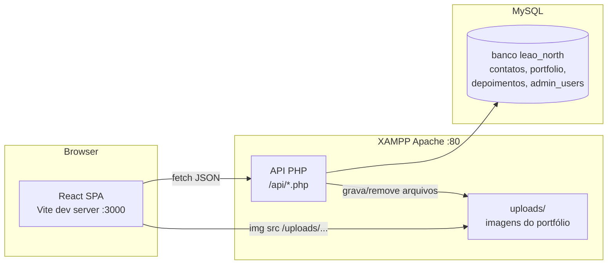

# CONTEXT — Leão North (Instalações Elétricas)

> **Para quem é este documento:** outra IA (ou desenvolvedor) que receber acesso a este projeto
> precisa entender, em poucos minutos, **o que** o aplicativo faz, **como** está arquitetado,
> **como funciona** e **o que há em cada arquivo**.

---

## 1. Visão Geral do Aplicativo

A **Leão North** é uma empresa de engenharia elétrica com sede em **Cornélio Procópio - PR**
(R. Paraíba, 830 - Centro). Este repositório contém o **site institucional** da empresa, que serve
dois propósitos principais:

1. **Vitrine pública (one-page landing):** apresenta a empresa, serviços, portfólio de projetos,
   depoimentos de clientes e um formulário de orçamento.
2. **Painel administrativo (admin):** permite ao dono da empresa **gerenciar o conteúdo do site**
   sem precisar de código — adicionar/remover projetos do portfólio, visualizar mensagens de
   orçamento recebidas e cadastrar/editar/excluir depoimentos.

O site é um **SPA em React** que roda na pasta do **XAMPP** (`c:/xampp/htdocs/leaonorth`) e conversa
com uma **API em PHP** servida pelo próprio Apache do XAMPP, persistindo dados em **MySQL**.

---

## 2. Stack Tecnológica

| Camada | Tecnologia |
| --- | --- |
| Frontend | React 19 + TypeScript + Vite 7 |
| Estilo | Tailwind CSS 4 + shadcn/ui (Radix UI) |
| Roteamento | Wouter 3 (client-side routing) |
| Animações | CSS + IntersectionObserver (scroll reveal) |
| Backend | PHP 8 (PDO/MySQL) servido pelo Apache do XAMPP |
| Banco de dados | MySQL — database `leao_north` |
| Upload de imagens | PHP `move_uploaded_file` → pasta `uploads/` |
| Ícones | lucide-react |
| Fonte | Barlow Condensed (títulos) + DM Sans (corpo), via Google Fonts |
| Gerenciador de pacotes | pnpm (também há `package-lock.json`) |

> **Importante:** o frontend e o backend **não** rodam juntos no mesmo processo. O backend PHP
> (`/api/...`) é servido pelo **Apache do XAMPP** em `http://localhost/leaonorth/api/...`, e o
> frontend (Vite dev server, porta 3000) faz requisições `fetch` para essas URLs absolutas.

---

## 3. Arquitetura Geral



### Fluxo de dados principal

1. O usuário acessa o site (página `/`). O React monta a `Home` com suas seções.
2. Seções dinâmicas (**Portfólio**, **Depoimentos**) buscam dados via `fetch` para a API PHP.
3. O visitante envia o formulário de orçamento → `POST /api/contato.php` → grava na tabela
   `contatos` e tenta disparar e-mail para `contato@leaonorth.com.br`.
4. O administrador acessa `/admin` (login) → token salvo no `localStorage` → `/admin/dashboard`
   para gerenciar portfólio, mensagens e depoimentos.

---

## 4. Estrutura de Diretórios

```
leaonorth/                          ← raiz do workspace (document root do site no XAMPP)
├── CONTEXT.md                      ← este documento
├── .gitignore
│
├── api/                            ← BACKEND PHP (usado de verdade pelo frontend)
│   ├── contato.php                 ← POST: salva orçamento + envia e-mail
│   ├── portfolio.php               ← GET: lista projetos do portfólio
│   ├── depoimentos.php             ← GET: lista depoimentos
│   └── admin/
│       ├── login.php               ← POST: autentica admin (password_verify)
│       ├── mensagens.php           ← GET: lista mensagens de contato
│       ├── add_depoimento.php      ← POST: cria depoimento
│       ├── edit_depoimento.php     ← PUT: edita depoimento
│       ├── delete_depoimento.php   ← DELETE: remove depoimento
│       ├── upload.php              ← POST: upload de imagem + insere no portfólio
│       └── delete.php              ← DELETE: remove projeto do portfólio
│
├── uploads/                        ← imagens enviadas pelo admin (portfólio)
│
└── leao-north-site/                ← FRONTEND React (código-fonte do site)
    ├── package.json                ← dependências e scripts
    ├── vite.config.ts              ← config do Vite (alias, plugins, debug logs)
    ├── tsconfig.json               ← config TypeScript (alias @, @shared)
    ├── components.json             ← config shadcn/ui
    ├── index.html (client/)        ← HTML raiz (metas SEO + fontes)
    ├── client/
    │   ├── public/__manus__/       ← debug collector do Manus (dev tooling)
    │   └── src/
    │       ├── main.tsx            ← entry point React
    │       ├── App.tsx             ← rotas (/, /admin, /admin/dashboard, /404)
    │       ├── index.css           ← design system (cores/tipografia/utilitários)
    │       ├── const.ts            ← constantes OAuth (não usado no fluxo atual)
    │       ├── pages/
    │       │   ├── Home.tsx        ← landing page (compõe todas as seções)
    │       │   ├── NotFound.tsx    ← página 404
    │       │   └── admin/
    │       │       ├── Login.tsx   ← tela de login do painel
    │       │       └── Dashboard.tsx ← painel (portfólio/mensagens/depoimentos)
    │       ├── components/
    │       │   ├── Navbar.tsx      ← navbar fixa com blur
    │       │   ├── Footer.tsx      ← rodapé com links/contato/redes
    │       │   ├── WhatsAppButton.tsx ← botão flutuante do WhatsApp
    │       │   ├── ErrorBoundary.tsx ← captura erros de renderização
    │       │   ├── Map.tsx         ← componente Google Maps (do template; NÃO usado)
    │       │   ├── ManusDialog.tsx ← dialog de login do Manus (do template; NÃO usado)
    │       │   ├── sections/       ← seções da landing (Hero, About, Mission, ...)
    │       │   └── ui/             ← ~50 componentes shadcn/ui (biblioteca padrão)
    │       ├── contexts/
    │       │   └── ThemeContext.tsx ← provider de tema claro/escuro
    │       ├── hooks/
    │       │   ├── useScrollReveal.ts ← animação de scroll reveal
    │       │   ├── useComposition.ts  ← util para inputs (template)
    │       │   ├── useMobile.tsx      ← detecta mobile (template)
    │       │   └── usePersistFn.ts    ← função estável (template)
    │       └── lib/
    │           └── utils.ts        ← helper `cn()` (clsx + tailwind-merge)
    ├── server/index.ts             ← servidor Express placeholder (template; NÃO usado)
    ├── shared/const.ts             ← constantes compartilhadas (template)
    ├── patches/wouter@3.7.1.patch  ← patch do wouter (registra rotas no window)
    ├── ideas.md                    ← brainstorm de design (documentação)
    ├── template.json               ← manifest do template usado para criar o site
    └── api/                        ← CÓPIA ANTIGA da API PHP (NÃO usada; ver §7)
```

---

## 5. Backend PHP — Endpoints (raiz `/api`)

> Todos os endpoints usam **PDO** com credenciais do XAMPP local:
> host `localhost`, database `leao_north`, user `root`, senha vazia.
> Todos liberam **CORS** (`Access-Control-Allow-Origin: *`) e respondem **JSON**.

| Endpoint | Método | O que faz | Retorno |
| --- | --- | --- | --- |
| [`api/contato.php`](api/contato.php) | POST | Valida `name`, `phone`, `message`; insere em `contatos`; tenta enviar e-mail (via `mail()`) para `contato@leaonorth.com.br` | `200/400/500/503` + `mensagem` |
| [`api/portfolio.php`](api/portfolio.php) | GET | `SELECT id, img, title, category, size FROM portfolio ORDER BY id DESC` | array JSON de projetos |
| [`api/depoimentos.php`](api/depoimentos.php) | GET | `SELECT id, nome, estrelas, texto FROM depoimentos ORDER BY id DESC` | array JSON de depoimentos |
| [`api/admin/login.php`](api/admin/login.php) | POST | Busca usuário por e-mail na tabela `admin_users`; confere senha com `password_verify` | `200` com `token` (base64 de `id + timestamp`) ou `401` |
| [`api/admin/mensagens.php`](api/admin/mensagens.php) | GET | Lista `contatos` (id, nome, telefone, email, servico, mensagem, data_envio) | array JSON |
| [`api/admin/add_depoimento.php`](api/admin/add_depoimento.php) | POST | Insere em `depoimentos` (nome, estrelas, texto — texto opcional) | `200`/`500` |
| [`api/admin/edit_depoimento.php`](api/admin/edit_depoimento.php) | PUT | `UPDATE depoimentos SET nome, estrelas, texto WHERE id` | `200`/`400`/`500` |
| [`api/admin/delete_depoimento.php`](api/admin/delete_depoimento.php) | DELETE | `DELETE FROM depoimentos WHERE id` (id via query string) | `200`/`500` |
| [`api/admin/upload.php`](api/admin/upload.php) | POST | Recebe imagem (`$_FILES['image']`) + `title`/`category`/`size`; salva em `../../uploads/` com nome `time()_nome`; insere `img` (caminho `/uploads/...`) no `portfolio` | `200`/`400`/`500` |
| [`api/admin/delete.php`](api/admin/delete.php) | DELETE | `DELETE FROM portfolio WHERE id` (id via query string) | `200`/`500` |

### Observações de segurança/qualidade (importantes para quem for mexer)

- **Login "frouxo":** o token gerado (`base64(id + time())`) é apenas guardado no `localStorage`
  pelo frontend; **nenhum endpoint de admin valida de fato esse token** no servidor. Ou seja, a
  "proteção" é apenas client-side. Qualquer pessoa pode chamar os endpoints de escrita diretamente.
- **Injeção SQL:** todas as queries usam prepared statements (`bindParam`) — ok.
- **Upload:** não há validação de tipo/tamanho da imagem além do `accept="image/*"` no frontend.
- **Conexão:** as credenciais do banco estão hardcoded (padrão XAMPP: root/senha vazia).

---

## 6. Frontend React — Arquivos Principais

### Entrada e rotas

- [`client/src/main.tsx`](leao-north-site/client/src/main.tsx) — monta o `<App />` no `#root`.
- [`client/src/App.tsx`](leao-north-site/client/src/App.tsx) — define o `Router` (wouter `Switch`):
  - `/` → `Home`
  - `/admin` → `Login`
  - `/admin/dashboard` → `Dashboard`
  - qualquer outra → `NotFound`
  - Envolve tudo com `ErrorBoundary`, `ThemeProvider` (tema escuro) e `Toaster` (sonner).

### Página pública

- [`client/src/pages/Home.tsx`](leao-north-site/client/src/pages/Home.tsx) — compõe a landing
  na ordem: `Navbar` → `HeroSection` → `AboutSection` → `MissionSection` → `ServicesSection` →
  `PortfolioSection` → `DifferentialsSection` → `TestimonialsSection` → `ContactSection` →
  `Footer` → `WhatsAppButton`. Fundo geral `#080808`.

### Seções (components/sections)

| Arquivo | Conteúdo |
| --- | --- |
| [`HeroSection.tsx`](leao-north-site/client/src/components/sections/HeroSection.tsx) | Hero assimétrico: badge, título, CTAs (WhatsApp + scroll), estatísticas (100+ projetos, 4.2★, NR-10), imagem com clip-path diagonal |
| [`AboutSection.tsx`](leao-north-site/client/src/components/sections/AboutSection.tsx) | "Quem Somos": imagem, badge 10+ anos, texto institucional, 4 destaques |
| [`MissionSection.tsx`](leao-north-site/client/src/components/sections/MissionSection.tsx) | 3 cards: Missão, Visão e Valores (com tags de valores) |
| [`ServicesSection.tsx`](leao-north-site/client/src/components/sections/ServicesSection.tsx) | Grid com 7 serviços (Residencial, Comercial, Industrial, Projetos, Manutenção, Quadros, Infraestrutura) + card CTA "Solicite um Orçamento" |
| [`PortfolioSection.tsx`](leao-north-site/client/src/components/sections/PortfolioSection.tsx) | **Busca projetos via `fetch('http://localhost/leaonorth/api/portfolio.php')`**, exibe galeria em grid (item `size: "large"` ocupa mais espaço), com lightbox ao clicar |
| [`DifferentialsSection.tsx`](leao-north-site/client/src/components/sections/DifferentialsSection.tsx) | Lista vertical numerada (01–05) de diferenciais com ícones |
| [`TestimonialsSection.tsx`](leao-north-site/client/src/components/sections/TestimonialsSection.tsx) | **Busca depoimentos via `fetch('http://localhost/leaonorth/api/depoimentos.php')`**, calcula média de estrelas, mostra banner "Google" + cards. Se não houver depoimentos, a seção fica oculta (`hidden`) |
| [`ContactSection.tsx`](leao-north-site/client/src/components/sections/ContactSection.tsx) | Info de contato (endereço, telefone, e-mail), CTA do WhatsApp, **formulário de orçamento** que envia `POST` para `http://localhost/leaonorth/api/contato.php`, e mapa do Google (iframe) |

> **Padrão comum nas seções:** cada seção usa um `IntersectionObserver` para aplicar a classe de
> animação `.reveal` (fade-up com stagger). Isso está definido no [`index.css`](leao-north-site/client/src/index.css).

### Componentes compartilhados

- [`Navbar.tsx`](leao-north-site/client/src/components/Navbar.tsx) — fixa, ganha blur ao rolar
  (classe `.navbar-scrolled`), menu mobile hambúrguer, links âncora para as seções.
- [`Footer.tsx`](leao-north-site/client/src/components/Footer.tsx) — colunas: marca, links
  rápidos, serviços, contato; barra inferior com copyright.
- [`WhatsAppButton.tsx`](leao-north-site/client/src/components/WhatsAppButton.tsx) — botão
  flutuante verde com animação de pulso, link `https://wa.me/5543999190467`.
- [`ErrorBoundary.tsx`](leao-north-site/client/src/components/ErrorBoundary.tsx) — captura erros
  e mostra tela com stack + botão "Reload Page".
- [`Map.tsx`](leao-north-site/client/src/components/Map.tsx) — componente Google Maps do template
  (proxy da Manus). **Não é usado** pela página atual (o mapa do contato é um `<iframe>`).
- [`ManusDialog.tsx`](leao-north-site/client/src/components/ManusDialog.tsx) — dialog de login da
  Manus, **não usado** no fluxo atual.
- [`components/ui/`](leao-north-site/client/src/components/ui/) — biblioteca **shadcn/ui** padrão
  (~50 componentes: button, card, dialog, accordion, etc.). São prontos do template; a landing
  customizada usa principalmente classes Tailwind, e o admin usa componentes simples próprios.

### Admin

- [`client/src/pages/admin/Login.tsx`](leao-north-site/client/src/pages/admin/Login.tsx) — tela
  de login. Envia `POST` para `http://localhost/leaonorth/api/admin/login.php` com e-mail/senha;
  em sucesso salva `admin_token` no `localStorage` e navega para `/admin/dashboard`.
- [`client/src/pages/admin/Dashboard.tsx`](leao-north-site/client/src/pages/admin/Dashboard.tsx) —
  painel com **sidebar** e 3 abas:
  - **Portfólio:** formulário de upload (título, categoria, tamanho, imagem) → `upload.php`;
    lista projetos com botão de excluir → `delete.php`.
  - **Caixa de Entrada:** tabela de mensagens de orçamento → `mensagens.php`.
  - **Depoimentos:** formulário para criar/editar (adicionar → `add_depoimento.php`; editar →
    `edit_depoimento.php` com PUT) e excluir → `delete_depoimento.php`.
  - Redireciona para `/admin` se não existir `admin_token` no `localStorage`.

### Contextos, hooks e utilitários

- [`contexts/ThemeContext.tsx`](leao-north-site/client/src/contexts/ThemeContext.tsx) — provider
  de tema (aplicação usa `defaultTheme="dark"`; não é `switchable`).
- [`hooks/useScrollReveal.ts`](leao-north-site/client/src/hooks/useScrollReveal.ts) — hook de
  reveal ao rolar (as seções atuais implementam a lógica inline com `IntersectionObserver`).
- [`hooks/useComposition.ts`](leao-north-site/client/src/hooks/useComposition.ts),
  [`hooks/useMobile.tsx`](leao-north-site/client/src/hooks/useMobile.tsx),
  [`hooks/usePersistFn.ts`](leao-north-site/client/src/hooks/usePersistFn.ts) — utilitários
  herdados do template.
- [`lib/utils.ts`](leao-north-site/client/src/lib/utils.ts) — exporta `cn()`.

### Design system (`client/src/index.css`)

- Paleta **"Tech Engineering Dark Gold"**: preto profundo `#080808` + dourado `#F0B429` + branco.
- Tokens de cor definidos via `oklch` (`--primary`, `--gold`, etc.).
- Tipografia: `Barlow Condensed` (títulos) e `DM Sans` (corpo).
- Utilitários customizados: `.text-gold-gradient`, `.gold-glow`, `.reveal`, `.service-card`,
  `.navbar-scrolled`, `.wa-pulse`, `.stagger-children`.

### Fontes e SEO (`client/index.html`)

- `lang="pt-BR"`, título "Leão North — Instalações Elétricas e Engenharia Elétrica", meta tags de
  SEO/OG e link canônico `https://leaonorth.com.br`.
- Google Fonts: `Barlow+Condensed` e `DM+Sans`.

---

## 7. Banco de Dados — Database `leao_north`

O schema não está versionado em SQL neste repositório (é criado manualmente no phpMyAdmin/XAMPP).
As tabelas são inferidas pelos scripts PHP:

| Tabela | Colunas inferidas | Usada por |
| --- | --- | --- |
| `contatos` | `id`, `nome`, `telefone`, `email`, `servico`, `mensagem`, `data_envio` | `contato.php` (insert), `mensagens.php` (select) |
| `portfolio` | `id`, `img`, `title`, `category`, `size` | `portfolio.php` (select), `upload.php` (insert), `delete.php` (delete) |
| `depoimentos` | `id`, `nome`, `estrelas`, `texto` | `depoimentos.php` (select), `add_depoimento.php` (insert), `edit_depoimento.php` (update), `delete_depoimento.php` (delete) |
| `admin_users` | `id`, `email`, `password` | `login.php` (select + `password_verify`) |

> **Nota:** a senha do admin deve ser gerada com `password_hash()` (ex.: `password_hash('123456',
> PASSWORD_DEFAULT)`) para o `password_verify` funcionar. Não há script de seed no repo.

---

## 8. Como Rodar Localmente (XAMPP)

1. **Apache + MySQL** do XAMPP ligados.
2. Criar o banco `leao_north` e as tabelas da §7 (no phpMyAdmin).
3. Colocar o projeto em `C:\xampp\htdocs\leaonorth` (já é a raiz do workspace).
4. A API PHP fica disponível em `http://localhost/leaonorth/api/...` (testar no navegador).
5. Frontend:
   ```bash
   cd leao-north-site
   pnpm install   # ou npm install
   pnpm dev       # sobe o Vite em http://localhost:3000
   ```
   > O frontend **não funciona sozinho** sem a API: as seções de portfólio/depoimentos e o
   > formulário dependem de `http://localhost/leaonorth/api/...`.
6. **Painel admin:** acesse `http://localhost:3000/admin` (ou `/admin` no build). É preciso ter um
   registro em `admin_users` com senha `password_hash`-ada.

### Scripts do frontend (package.json)

- `pnpm dev` — Vite dev server (`--host`)
- `pnpm build` — `vite build` + bundle do `server/index.ts` via esbuild
- `pnpm start` — roda o servidor Express de produção (`node dist/index.js`)
- `pnpm check` — `tsc --noEmit`
- `pnpm format` — Prettier

---

## 9. Arquivos que Fazem Parte do Template (NÃO usar/editar sem necessidade)

Estes arquivos foram gerados pelo template base e **não participam do fluxo real** do site:

- [`leao-north-site/server/index.ts`](leao-north-site/server/index.ts) — servidor Express
  placeholder (serve estáticos; o site real usa Apache + PHP).
- [`leao-north-site/shared/const.ts`](leao-north-site/shared/const.ts) — constantes placeholder.
- [`leao-north-site/client/src/const.ts`](leao-north-site/client/src/const.ts) — função
  `getLoginUrl()` para OAuth da Manus (não usado).
- [`leao-north-site/client/src/components/Map.tsx`](leao-north-site/client/src/components/Map.tsx)
  e [`ManusDialog.tsx`](leao-north-site/client/src/components/ManusDialog.tsx) — não usados.
- [`leao-north-site/client/public/__manus__/debug-collector.js`](leao-north-site/client/public/__manus__/debug-collector.js)
  — script de debug (envia logs para `/__manus__/logs` no dev). Infraestrutura de desenvolvimento.
- [`leao-north-site/patches/wouter@3.7.1.patch`](leao-north-site/patches/wouter@3.7.1.patch) —
  patch que registra as rotas do wouter em `window.__WOUTER_ROUTES__` (dev tooling).
- [`leao-north-site/template.json`](leao-north-site/template.json) e
  [`leao-north-site/README.md`](leao-north-site/README.md) — manifest/readme do template.
- [`leao-north-site/ideas.md`](leao-north-site/ideas.md) — brainstorm de design (histórico).

---

## 10. ⚠️ Pontos de Atenção (deixar claro para quem for trabalhar no projeto)

1. **API duplicada (confusão potencial):** existe uma **cópia antiga** da API em
   [`leao-north-site/api/`](leao-north-site/api/) (com placeholders tipo `db_name = "nome_do_banco"`,
   sem CORS completo, `SELECT` sem `id`). **O frontend NÃO usa essa cópia** — ele chama sempre
   `http://localhost/leaonorth/api/...`, ou seja, a API **na raiz** do projeto. **Não edite a cópia**
   pensando que é a ativa; se for mexer, mantenha a da raiz como fonte da verdade.
2. **URLs hardcoded:** o frontend contém `http://localhost/leaonorth/...` fixo em vários arquivos
   (`PortfolioSection`, `TestimonialsSection`, `ContactSection`, `Login`, `Dashboard`). Em produção
   isso precisaria ser ajustado para o domínio real (`https://leaonorth.com.br`).
3. **Autenticação client-side apenas:** o `admin_token` não é validado no backend; qualquer
   endpoint admin pode ser chamado sem token. Se for evoluir, implementar verificação de token/sessão
   no PHP.
4. **Design visual é dark + dourado** — mantenha consistência se adicionar novas seções (usar os
   tokens do [`index.css`](leao-north-site/client/src/index.css) e a fonte Barlow Condensed/DM Sans).
5. **Credenciais do banco hardcoded** em todos os PHP (root/senha vazia) — padrão local XAMPP.
6. **Upload de arquivos:** o caminho `../../uploads/` é relativo à pasta `api/admin/`, resolvendo
   para `leaonorth/uploads/` (raiz do site). É lá que ficam as imagens exibidas no portfólio.
7. **Sem teste automatizado** no projeto (apenas `tsc --noEmit` via `pnpm check`).
