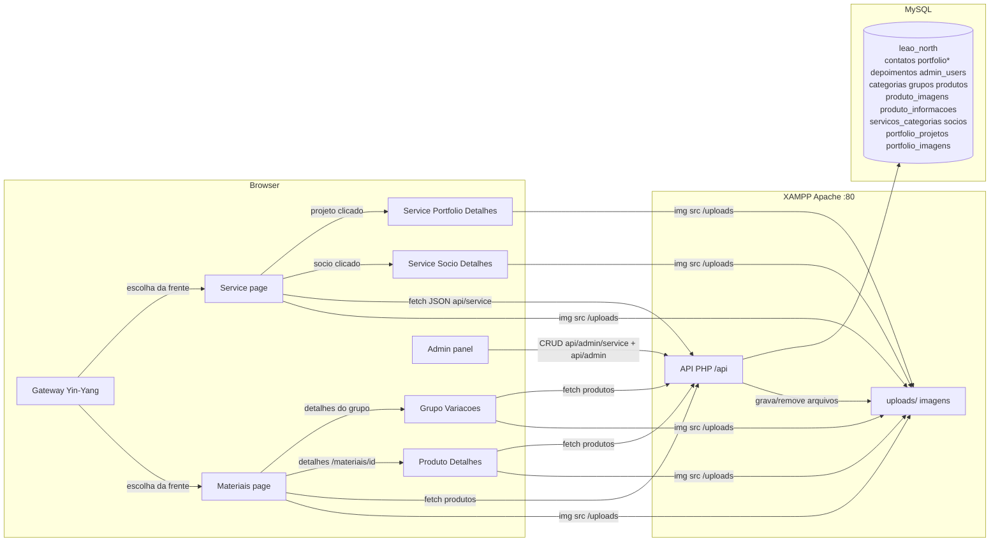

# CONTEXT — Leão North (Instalações Elétricas + Materiais)

> **Para quem é este documento:** outra IA (ou desenvolvedor) que receber acesso a este projeto
> precisa entender, em poucos minutos, **o que** o aplicativo faz, **como** está arquitetado,
> **como funciona** e **o que há em cada arquivo**.

---

## 1. Visão Geral do Aplicativo

A **Leão North** é uma empresa de engenharia elétrica com sede em **Cornélio Procópio - PR**
(R. Paraíba, 830 - Centro). O domínio principal atende **duas frentes de negócio** no mesmo SPA
(conceito "Yin-Yang"):

1. **Leão North Service** — serviços elétricos (tema escuro). Apresenta a empresa, serviços,
   portfólio, depoimentos, sócios e formulário de orçamento.
2. **Leão North Materiais** — catálogo de produtos elétricos para venda casada (tema claro).
   Produtos com **múltiplas imagens** (com capa), descrição longa e informações adicionais
   (chave/valor). O interesse é encaminhado via WhatsApp e há uma **página de detalhes** por produto
   com galeria, zoom ("lupa") e CTA de venda.

> **Versão 2.0 (modelo relacional):** o catálogo de Materiais evoluiu de "strings soltas" para um
> modelo **relacional**: as **Categorias** e os **Grupos** (famílias de produtos, ex.: *Painel de Led
> Quadrado*) são agora **entidades no banco** (tabelas `categorias` e `grupos`), cada grupo com
> **1 capa exclusiva** (`caminho_imagem_capa`), e os produtos referenciam **IDs** (`categoria_id` e
> `grupo_id`) em vez de textos. A **vitrine** agrupa produtos por grupo (1 card por família) e o
> **painel admin** foi seccionado em **"Leão Materiais"** (Categorias, Grupos, Produtos) ×
> **"Leão Service"** (Portfólio, Depoimentos) × **Geral** (Mensagens).

> **Fases 20–21 (UI/UX da vitrine Materiais):** a frente "Leão Materiais" passou a ter experiência
> **própria e separada** da institucional. A **Fase 20** criou o header exclusivo
> ([`HeaderMateriais.tsx`](leao-north-site/client/src/components/HeaderMateriais.tsx)) com **busca
> global** (Enter → `/materiais?q=...`, lida via `window.location.search`), footer enxuto
> ([`FooterMateriais.tsx`](leao-north-site/client/src/components/FooterMateriais.tsx)) e **sidebar
> vertical de categorias** (desktop sticky / `Sheet` off-canvas no mobile). A **Fase 21** adicionou
> **ordenação** (Padrão/A–Z/Z–A), **breadcrumbs** e **estado vazio persuasivo** com CTA de WhatsApp.
> As rotas do catálogo (`/materiais*`) **não herdam** mais o menu institucional — o Service segue com
> `Navbar`/`Footer`. Planejamentos: [`fase20_vitrine_ux.md`](zoo_code_docs/fase20_vitrine_ux.md) e
> [`fase21_vitrine_refinamentos.md`](zoo_code_docs/fase21_vitrine_refinamentos.md).

> **Fases 22–24 (Leão Service relacional):** a frente **Service** também evoluiu de textos fixos/
> legados para o modelo **relacional**, espelhando a Versão 2.0. **Serviços** (`servicos_categorias`),
> **Sócios** (`socios`) e **Projetos de Portfólio** (`portfolio_projetos` + `portfolio_imagens`) são
> entidades gerenciadas no painel e exibidas **dinamicamente** no site:
> - **Fase 22 (backend):** DDL + backfill em [`api/migracao_service.sql`](api/migracao_service.sql),
>   APIs públicas [`api/service/`](api/service/portfolio.php) e CRUDs
>   [`api/admin/service/`](api/admin/service/add_projeto.php) —
>   [`fase22_service_backend.md`](zoo_code_docs/fase22_service_backend.md).
> - **Fase 23 (painel):** abas Serviços/Portfólio/Sócios via componentes dedicados (`AdminServicos`,
>   `AdminPortfolio`, `AdminSocios` em
>   [`pages/admin/service/`](leao-north-site/client/src/pages/admin/service/AdminServicos.tsx)),
>   substituindo o CRUD legado de portfólio — [`fase23_service_admin.md`](zoo_code_docs/fase23_service_admin.md).
> - **Fase 24 (site público):** seções do `/service` dinâmicas + páginas de detalhes
>   [`PortfolioDetalhes.tsx`](leao-north-site/client/src/pages/PortfolioDetalhes.tsx) e
>   [`SocioDetalhes.tsx`](leao-north-site/client/src/pages/SocioDetalhes.tsx) (rotas
>   `/service/portfolio/:id` e `/service/socio/:id`) —
>   [`fase24_service_publico.md`](zoo_code_docs/fase24_service_publico.md).
>
> ⚠️ O legado `portfolio` (tabela + APIs antigas [`api/portfolio.php`](api/portfolio.php),
> [`api/admin/upload.php`](api/admin/upload.php), [`api/admin/delete.php`](api/admin/delete.php))
> **permanece no repo, porém sem uso** (deixou de ser consumido na Fase 24; limpeza em fase futura).

A experiência começa no **Portal Gateway** (split-screen), onde o visitante escolhe entre **Service**
e **Materiais**. Há também o **Painel Administrativo** (`/admin`), que permite gerenciar
**categorias**, **grupos** (com upload de capa), **produtos (criar, editar, excluir e duplicar)**,
**serviços**, **projetos de portfólio** e **sócios**, mensagens e depoimentos.

O site é um **SPA em React** que roda na pasta do **XAMPP** (`c:/xampp/htdocs/leaonorth`) e conversa
com uma **API em PHP** servida pelo Apache do XAMPP, persistindo dados em **MySQL**.

---

## 2. Stack Tecnológica

| Camada | Tecnologia |
| --- | --- |
| Frontend | React 19 + TypeScript + Vite 7 |
| Estilo | Tailwind CSS 4 + shadcn/ui (Radix UI) + tw-animate-css |
| Roteamento | Wouter 3 (client-side routing; rotas dinâmicas `/service/portfolio/:id`, `/service/socio/:id`, `/materiais/:id` e `/materiais/grupo/:id`). ⚠️ `useLocation` retorna **apenas o pathname** — query string lida via `window.location.search` (ver §10.13) |
| Animações | CSS + IntersectionObserver (scroll reveal) + tw-animate-css (Gateway) + zoom CSS (transform-origin) |
| Backend | PHP 8 (PDO/MySQL) servido pelo Apache do XAMPP |
| Banco de dados | MySQL — database `leao_north` |
| Upload de imagens | PHP `move_uploaded_file` → pasta `uploads/` (validação MIME real via `finfo` + 5MB) |
| Ícones | lucide-react |
| Fonte | Barlow Condensed (títulos) + DM Sans (corpo), via Google Fonts |
| Gerenciador de pacotes | pnpm (também há `package-lock.json`) |

> **Importante:** o frontend e o backend **não** rodam juntos no mesmo processo. O backend PHP
> (`/api/...`) é servido pelo **Apache do XAMPP** em `http://localhost/leaonorth/api/...`, e o
> frontend (Vite dev server, porta 3000) faz requisições `fetch` para essas URLs absolutas.

---

## 3. Arquitetura Geral


*portfolio = tabela legada, sem uso desde a Fase 24.*

### Fluxo de dados principal

1. O usuário acessa `/` → o **Portal Gateway** exibe as duas frentes (Service escuro / Materiais claro).
2. Escolhe **Service** (`/service`): landing compõe Hero, About, Mission, Services, Portfolio,
   Differentials, **Sócios**, Testimonials e Contact. As seções **Services, Portfólio, Sócios e
   Depoimentos** são dinâmicas e buscam dados via `fetch` na API PHP — Serviços/Sócios/Portfólio
   consomem `api/service/*` (Fase 24). Os cards de projeto têm **mini-carrossel**; clicar abre
   `/service/portfolio/:id` e `/service/socio/:id`.
3. Escolhe **Materiais** (`/materiais`): catálogo claro consumindo `api/produtos.php`. A **vitrine é
   agrupada** (Fases 13/19): produtos com `grupo_id` viram **1 card de grupo** (capa oficial do grupo
   = `grupo_capa`), e produtos sem grupo aparecem como cards individuais. A página usa **Header/
   Footer exclusivos** (Fase 20) e oferece **busca global** (`?q=`), **sidebar de categorias**
   (desktop/Sheet mobile), **ordenação** Padrão/A–Z/Z–A, **breadcrumbs** e **estado vazio com CTA de
   WhatsApp** (Fases 20/21).
4. Clica em **"Ver Opções"** de um grupo → **`/materiais/grupo/:id`** (`GrupoVariacoes.tsx`): lista as
   variações (produtos) daquele `grupo_id` com o card individual.
5. Clica em um produto (individual ou variação) → **`/materiais/:id`** (`ProdutoDetalhes.tsx`):
   galeria com zoom (lupa), descrição, informações adicionais e CTA "Tenho Interesse".
6. O visitante envia um formulário (orçamento, contato ou "falar com sócio") → `POST /api/contato.php`
   → grava em `contatos` com `tipo_mensagem` (service | materiais | socio) e tenta disparar e-mail
   para `contato@leaonorth.com.br`.
7. O administrador acessa `/admin` (login) → token no `localStorage` → `/admin/dashboard`. O painel
   tem **sidebar seccionado** ("Leão Materiais": Categorias/Grupos/Produtos · "Leão Service":
   Serviços/Portfólio/Sócios/Depoimentos · "Geral": Mensagens) para gerenciar **categorias**,
   **grupos (com capa)**, **produtos (criar/editar/excluir/duplicar, múltiplas imagens + capa +
   informações)** em listagem com **drill-down em pastas**, **serviços**, **projetos de portfólio
   (multi-imagem + capa)** e **sócios** (componentes de `pages/admin/service/`), além de mensagens
   (badges de origem) e depoimentos.

---

## 4. Estrutura de Diretórios

```
leaonorth/                          ← raiz do workspace (document root do site no XAMPP)
├── CONTEXT.md                      ← este documento
├── .gitignore
│
├── api/                            ← BACKEND PHP (usado de verdade pelo frontend)
│   ├── contato.php                 ← POST: salva contato/orçamento + tipo_mensagem + e-mail
│   ├── portfolio.php               ← GET: lista projetos do portfólio — LEGADO (sem uso desde a Fase 24)
│   ├── depoimentos.php             ← GET: lista depoimentos
│   ├── categorias.php              ← GET: lista categorias (relacional v2.0)
│   ├── grupos.php                  ← GET: lista grupos (com categoria_nome, capa e total de produtos)
│   ├── produtos.php                ← GET: lista produtos (LEFT JOIN categoria/grupo + imagens[]/informacoes[])
│   ├── migracao_v2.sql             ← DDL + backfill da migração para o modelo relacional (Fase 15)
│   ├── migracao_service.sql        ← DDL das 4 tabelas da Leão Service + seeds + backfill do legado (Fase 22)
│   ├── service/                    ← APIs PÚBLICAS da Leão Service (Fase 22/24)
│   │   ├── categorias.php          ← GET: lista serviços/categorias (servicos_categorias)
│   │   ├── socios.php              ← GET: lista sócios (socios)
│   │   └── portfolio.php           ← GET: projetos + categoria_nome (JOIN) + imagens[] + capa (raiz)
│   └── admin/
│       ├── login.php               ← POST: autentica admin (password_verify)
│       ├── mensagens.php           ← GET: lista mensagens de contato (inclui tipo_mensagem)
│       ├── add_depoimento.php / edit_depoimento.php / delete_depoimento.php ← CRUD depoimentos
│       ├── upload.php              ← POST (LEGADO, sem uso) + delete.php (DELETE, LEGADO)
│       ├── add_categoria.php / edit_categoria.php / delete_categoria.php ← CRUD categorias (Materiais)
│       ├── add_grupo.php / edit_grupo.php / delete_grupo.php ← CRUD grupos (com capa)
│       ├── add_produto.php / edit_produto.php / duplicate_produto.php / delete_produto.php ← CRUD produtos
│       └── service/                ← APIs ADMIN da Leão Service (Fase 22)
│           ├── add_categoria.php / edit_categoria.php / delete_categoria.php ← CRUD serviços/categorias
│           ├── add_socio.php / edit_socio.php / delete_socio.php ← CRUD sócios (foto única)
│           └── add_projeto.php / edit_projeto.php / delete_projeto.php ← CRUD projetos (multi-imagem + capa)
│
├── uploads/                        ← imagens (portfólio, produtos, capas de grupos, sócios)
│
├── zoo_code_docs/                  ← documentação de planejamento das fases (fase1..fase24)
│
└── leao-north-site/                ← FRONTEND React (código-fonte do site)
    ├── package.json                ← dependências e scripts
    ├── vite.config.ts              ← config do Vite (alias, plugins, debug logs)
    ├── tsconfig.json               ← config TypeScript (alias @, @shared)
    ├── components.json             ← config shadcn/ui
    ├── index.html (client/)        ← HTML raiz (metas SEO + fontes)
    ├── client/
    │   ├── public/__manus__/       ← debug collector do Manus (dev tooling)
    │   └── src/
    │       ├── main.tsx            ← entry point React
    │       ├── App.tsx             ← rotas (/, /service, /service/portfolio/:id, /service/socio/:id, /materiais, /materiais/grupo/:id, /materiais/:id, /admin, /admin/dashboard, /404)
    │       ├── index.css           ← design system (cores/tipografia/utilitários)
    │       ├── const.ts            ← constantes OAuth (não usado no fluxo atual)
    │       ├── pages/
    │       │   ├── Gateway.tsx     ← Portal Yin-Yang (escolha Service × Materiais)
    │       │   ├── Service.tsx     ← landing da Leão North Service
    │       │   ├── PortfolioDetalhes.tsx ← página do projeto (/service/portfolio/:id) — Fase 24
    │       │   ├── SocioDetalhes.tsx ← página do sócio (/service/socio/:id) — Fase 24
    │       │   ├── Materiais.tsx   ← vitrine Materiais (busca global, sidebar, ordenação, breadcrumbs)
    │       │   ├── GrupoVariacoes.tsx ← página de variações de um grupo (/materiais/grupo/:id)
    │       │   ├── ProdutoDetalhes.tsx ← página de detalhes do produto (galeria + zoom/lupa)
    │       │   ├── NotFound.tsx    ← página 404
    │       │   └── admin/
    │       │       ├── Login.tsx   ← tela de login do painel
    │       │       ├── Dashboard.tsx ← painel orquestrador (sidebar + abas + monta componentes)
    │       │       └── service/    ← componentes do painel da Leão Service (Fase 23)
    │       │           ├── AdminServicos.tsx ← CRUD Serviços (categorias de serviço)
    │       │           ├── AdminPortfolio.tsx ← CRUD Portfólio (multi-imagem + capa)
    │       │           └── AdminSocios.tsx ← CRUD Sócios (foto única)
    │       ├── components/
    │       │   ├── HeaderMateriais.tsx ← header EXCLUSIVO da frente Materiais
    │       │   ├── FooterMateriais.tsx ← rodapé enxuto da frente Materiais
    │       │   ├── Navbar.tsx      ← navbar institucional fixa; prop variant="dark" | "light" e simple (Fase 24)
    │       │   ├── Footer.tsx      ← rodapé escuro institucional (Service)
    │       │   ├── WhatsAppButton.tsx ← botão flutuante do WhatsApp
    │       │   ├── ErrorBoundary.tsx ← captura erros de renderização
    │       │   ├── ProdutoCard.tsx ← card de produto compartilhado
    │       │   ├── sections/       ← seções da landing Service
    │       │   │   ├── HeroSection.tsx, AboutSection.tsx, MissionSection.tsx,
    │       │   │   ├── ServicesSection.tsx, PortfolioSection.tsx, DifferentialsSection.tsx,
    │       │   │   ├── SociosSection.tsx, TestimonialsSection.tsx, ContactSection.tsx
    │       │   └── ui/             ← ~50 componentes shadcn/ui (biblioteca padrão)
    │       ├── contexts/
    │       │   └── ThemeContext.tsx ← provider de tema claro/escuro (app usa dark)
    │       ├── hooks/              ← useScrollReveal, useMobile, useComposition, usePersistFn (utils)
    │       └── lib/
    │           └── utils.ts        ← helper `cn()` (clsx + tailwind-merge)
    ├── server/index.ts             ← servidor Express placeholder (template; NÃO usado)
    ├── shared/const.ts             ← constantes compartilhadas (template)
    ├── patches/wouter@3.7.1.patch  ← patch do wouter (registra rotas no window)
    ├── ideas.md                    ← brainstorm de design (documentação)
    └── README.md                   ← readme do template
```

---

## 5. Backend PHP — Endpoints (raiz `/api`)

> Todos os endpoints usam **PDO** com credenciais do XAMPP local: host `localhost`, database
> `leao_north`, user `root`, senha vazia. Todos liberam **CORS**
> (`Access-Control-Allow-Origin: *`) e respondem **JSON**.

### Catálogo relacional (Versão 2.0)

| Endpoint | Método | O que faz | Retorno |
| --- | --- | --- | --- |
| [`api/contato.php`](api/contato.php) | POST | Valida `name`, `phone`, `message`; insere em `contatos` **incluindo `tipo_mensagem`** (whitelist `service`/`materiais`/`socio`, default `service`); tenta enviar e-mail com a origem | `200/400/500/503` + `mensagem` |
| [`api/portfolio.php`](api/portfolio.php) | GET | `SELECT id, img, title, category, size FROM portfolio ORDER BY id DESC` — **LEGADO** (sem uso desde a Fase 24) | array JSON |
| [`api/depoimentos.php`](api/depoimentos.php) | GET | `SELECT id, nome, estrelas, texto FROM depoimentos ORDER BY id DESC` | array JSON |
| [`api/categorias.php`](api/categorias.php) | GET | Lista `categorias` (`id, nome ORDER BY nome`) — usada pela vitrine e pelo painel | array JSON |
| [`api/grupos.php`](api/grupos.php) | GET | Lista `grupos` com `categoria_id`/`categoria_nome` (JOIN), `caminho_imagem_capa` e `total_produtos` (COUNT); filtro opcional `?categoria_id=` | array JSON |
| [`api/produtos.php`](api/produtos.php) | GET | Lista produtos com **`LEFT JOIN`** de `categorias`/`grupos` (expondo `categoria_id`/`categoria_nome`/`grupo_id`/`grupo_nome`/`grupo_capa`), `descricao` e **arrays aninhados** `imagens[]`/`informacoes[]` (3 queries com `IN (ids)`, sem N+1); filtros `?categoria_id=`/`?grupo_id=` | array JSON |
| [`api/admin/login.php`](api/admin/login.php) | POST | Busca usuário por e-mail em `admin_users`; confere senha com `password_verify` | `200` com `token` ou `401` |
| [`api/admin/mensagens.php`](api/admin/mensagens.php) | GET | Lista `contatos` **incluindo `tipo_mensagem`** (id, nome, telefone, email, servico, mensagem, tipo_mensagem, data_envio) | array JSON |
| [`api/admin/add_depoimento.php`](api/admin/add_depoimento.php) | POST | Insere em `depoimentos` (nome, estrelas, texto — texto opcional) | `200`/`500` |
| [`api/admin/edit_depoimento.php`](api/admin/edit_depoimento.php) | PUT | `UPDATE depoimentos SET nome, estrelas, texto WHERE id` | `200`/`400`/`500` |
| [`api/admin/delete_depoimento.php`](api/admin/delete_depoimento.php) | DELETE | `DELETE FROM depoimentos WHERE id` (id via query string) | `200`/`500` |
| [`api/admin/upload.php`](api/admin/upload.php) | POST | **LEGADO** (portfólio antigo) — não é mais chamado pelo painel | — |
| [`api/admin/delete.php`](api/admin/delete.php) | DELETE | **LEGADO** (portfólio antigo) — não é mais chamado pelo painel | — |
| [`api/admin/add_categoria.php`](api/admin/add_categoria.php) | POST | Cria `categorias` (`nome`, UNIQUE); `409` em duplicidade | `200`/`400`/`409`/`500` |
| [`api/admin/edit_categoria.php`](api/admin/edit_categoria.php) | POST | `UPDATE categorias SET nome WHERE id` | `200`/`400`/`409`/`500` |
| [`api/admin/delete_categoria.php`](api/admin/delete_categoria.php) | DELETE | `DELETE FROM categorias WHERE id`; `409` se houver grupos (FK `RESTRICT`) | `200`/`400`/`409`/`500` |
| [`api/admin/add_grupo.php`](api/admin/add_grupo.php) | POST | Cria `grupos` (`nome`, `categoria_id`) + **1 capa obrigatória** (`$_FILES['capa']`, MIME real + 5MB); `409` em duplicidade na categoria | `200`/`400`/`409`/`500` |
| [`api/admin/edit_grupo.php`](api/admin/edit_grupo.php) | POST | Edita `grupos` (`nome`, `categoria_id`); capa nova (substitui/`unlink` antiga) ou `remover_capa=1` | `200`/`400`/`404`/`409`/`500` |
| [`api/admin/delete_grupo.php`](api/admin/delete_grupo.php) | DELETE | Exclui `grupos` + `unlink` da capa; produtos ficam sem grupo (`ON DELETE SET NULL`) | `200`/`400`/`500` |
| [`api/admin/add_produto.php`](api/admin/add_produto.php) | POST | Cadastra produto (**`categoria_id` obrigatório**, `grupo_id` opcional, `descricao`) com **1 a 8 imagens** (`$_FILES['imagens']`), `capa_index`, `informacoes` (JSON) — transação, MIME real (`finfo`) e 5MB | `200`/`400`/`500` |
| [`api/admin/edit_produto.php`](api/admin/edit_produto.php) | POST | **Edita** produto (`categoria_id`/`grupo_id`); `imagens_mantidas` (JSON) + `novas_imagens` (`$_FILES`); exclui removidas (banco + `unlink`); capa pela lista combinada; informações deletadas/reinseridas — transação | `200`/`400`/`500` |
| [`api/admin/duplicate_produto.php`](api/admin/duplicate_produto.php) | POST | **Duplica** produto: copia dados + **arquivos físicos** via `copy()` (novos nomes `time()_indice_nome`) — transação + rollback com `unlink` | `200` (com `id`) /`400`/`404`/`500` |
| [`api/admin/delete_produto.php`](api/admin/delete_produto.php) | DELETE | Resgata **todas** as imagens de `produto_imagens` antes do `DELETE FROM produtos` (FKs `ON DELETE CASCADE`); faz `unlink` de todos os arquivos | `200`/`400`/`500` |

### Leão Service relacional (Fases 22–24)

| Endpoint | Método | O que faz | Retorno |
| --- | --- | --- | --- |
| [`api/service/categorias.php`](api/service/categorias.php) | GET | Lista serviços/categorias (`servicos_categorias`) — `SELECT id, nome, descricao ORDER BY id` | array JSON |
| [`api/service/socios.php`](api/service/socios.php) | GET | Lista sócios (`socios`) — `id, nome, subtitulo, descricao, caminho_foto` | array JSON |
| [`api/service/portfolio.php`](api/service/portfolio.php) | GET | Lista projetos com `categoria_nome` (LEFT JOIN), **`imagens[]`** (capa primeiro, sem N+1) e o atalho **`capa` na raiz**; filtros `?servico_categoria_id=` e `?id=` | array JSON |
| [`api/admin/service/add_categoria.php`](api/admin/service/add_categoria.php) | POST | Cria serviço/categoria (`nome`, `descricao`); `409` em duplicidade (nome UNIQUE) | `200`/`400`/`409`/`500` |
| [`api/admin/service/edit_categoria.php`](api/admin/service/edit_categoria.php) | POST | Edita serviço/categoria (`id`, `nome`, `descricao`) | `200`/`400`/`404`/`409`/`500` |
| [`api/admin/service/delete_categoria.php`](api/admin/service/delete_categoria.php) | DELETE | Exclui serviço/categoria — projetos ficam `NULL` via `ON DELETE SET NULL` | `200`/`400`/`500` |
| [`api/admin/service/add_socio.php`](api/admin/service/add_socio.php) | POST | Cria sócio (`nome`, `subtitulo`, `descricao`) + **foto única opcional** (`$_FILES['foto']`) | `200`/`400`/`500` |
| [`api/admin/service/edit_socio.php`](api/admin/service/edit_socio.php) | POST | Edita sócio; nova foto (substitui) ou `remover_foto=1` | `200`/`400`/`404`/`500` |
| [`api/admin/service/delete_socio.php`](api/admin/service/delete_socio.php) | DELETE | Exclui sócio + `unlink` da foto física | `200`/`400`/`404`/`500` |
| [`api/admin/service/add_projeto.php`](api/admin/service/add_projeto.php) | POST | Cria projeto (`titulo` obrig., `subtitulo`, `descricao`, `servico_categoria_id` opcional) com **1 a 8 imagens** (`$_FILES['imagens']`) + `capa_index` (is_capa) | `200`/`400`/`500` |
| [`api/admin/service/edit_projeto.php`](api/admin/service/edit_projeto.php) | POST | Edita projeto; `imagens_mantidas` (JSON) + `novas_imagens[]` + `capa_index` (lista combinada); remove/exclui com `unlink` | `200`/`400`/`404`/`500` |
| [`api/admin/service/delete_projeto.php`](api/admin/service/delete_projeto.php) | DELETE | Resgata todas as imagens e faz `unlink`; `DELETE` + CASCADE | `200`/`400`/`500` |

> **Caminho do upload nos endpoints `api/admin/service/*`:** por estarem um nível mais fundo que os de
> `api/admin/`, eles usam **`../../../uploads/`** (resolve para a pasta `uploads/` da raiz). ⚠️ Bug
> corrigido na Fase 24: usavam `../../uploads/` (apontava para `api/uploads/`) — arquivos
> já gravados no local errado foram movidos para `uploads/`.

### Sobre o campo `tipo_mensagem`

- **`contato.php`**: aceita `tipo_mensagem` no payload JSON e valida com whitelist
  (`service`, `materiais`, `socio`); se ausente/inválido, usa `service`. A origem também é incluída
  no corpo do e-mail de notificação.
- **`mensagens.php`**: o `SELECT` retorna `tipo_mensagem` para o painel exibir o badge de origem.

### Observações de segurança/qualidade (importantes para quem for mexer)

- **Login "frouxo":** o token (`base64(id + time())`) é guardado apenas no `localStorage`; **nenhum
  endpoint de admin valida de fato esse token** no servidor. A "proteção" é client-side.
- **Injeção SQL:** todas as queries usam prepared statements (`bindParam`/`bindValue`) — ok.
- **Upload:** endpoints de produto/grupo/serviço validam **MIME real via `finfo`** e **5MB**.
- **Conexão:** credenciais do banco hardcoded (padrão XAMPP: root/senha vazia).

---

## 6. Frontend React — Arquivos Principais

### Entrada e rotas

- [`client/src/main.tsx`](leao-north-site/client/src/main.tsx) — monta o `<App />` no `#root`.
- [`client/src/App.tsx`](leao-north-site/client/src/App.tsx) — define o `Router` (wouter `Switch`):
  - `/` → **`Gateway`** (Portal Yin-Yang)
  - `/service` → **`Service`**
  - `/service/portfolio/:id` → **`PortfolioDetalhes`** (Fase 24)
  - `/service/socio/:id` → **`SocioDetalhes`** (Fase 24)
  - `/materiais` → **`Materiais`** (vitrine agrupada)
  - `/materiais/grupo/:id` → **`GrupoVariacoes`** (variações de um grupo, por ID)
  - `/materiais/:id` → **`ProdutoDetalhes`** (rota dinâmica)
  - `/admin` → `Login`
  - `/admin/dashboard` → `Dashboard`
  - qualquer outra → `NotFound`
  - Envolve tudo com `ErrorBoundary`, `ThemeProvider` (tema escuro) e `Toaster` (sonner).

### Páginas

| Página | Função |
| --- | --- |
| [`Gateway.tsx`](leao-north-site/client/src/pages/Gateway.tsx) | **Portal de escolha (Yin-Yang):** tela dividida em duas metades. Lado esquerdo **Service** (fundo `#080808`, dourado, → `/service`) e lado direito **Materiais** (fundo claro, → `/materiais`). |
| [`Service.tsx`](leao-north-site/client/src/pages/Service.tsx) | **Leão North Service:** compõe `Navbar` → Hero → About → Mission → **Services (dinâmico)** → **Portfolio (dinâmico, cards com mini-carrossel)** → Differentials → **Sócios (dinâmico)** → Testimonials → Contact → Footer → WhatsAppButton. Fundo `#080808`. |
| [`PortfolioDetalhes.tsx`](leao-north-site/client/src/pages/PortfolioDetalhes.tsx) | **Detalhes do projeto** (`/service/portfolio/:id`, Fase 24): tema escuro, galeria (capa no índice 0, setas, miniaturas, **zoom/lupa** no desktop — padrão `ProdutoDetalhes`), badge de categoria, Título/Subtítulo/Descrição e CTA WhatsApp. Usa `Navbar simple` + `Footer`. |
| [`SocioDetalhes.tsx`](leao-north-site/client/src/pages/SocioDetalhes.tsx) | **Detalhes do sócio** (`/service/socio/:id`, Fase 24): foto ampliada (aspect 3/4), Nome, Subtítulo, Descrição completa (fallback) e CTA WhatsApp. Usa `Navbar simple` + `Footer`. |
| [`Materiais.tsx`](leao-north-site/client/src/pages/Materiais.tsx) | **Leão North Materiais (tema claro) — vitrine agrupada + UX de conversão:** consome `api/produtos.php`, separa cards de grupo e individuais; Header/Footer exclusivos; sidebar de categorias; ordenação; breadcrumbs; estado vazio com CTA WhatsApp. |
| [`GrupoVariacoes.tsx`](leao-north-site/client/src/pages/GrupoVariacoes.tsx) | **Variações de um grupo** (`/materiais/grupo/:id`). |
| [`ProdutoDetalhes.tsx`](leao-north-site/client/src/pages/ProdutoDetalhes.tsx) | **Detalhes do produto** (`/materiais/:id`): galeria com zoom "lupa", descrição, informações e CTA "Tenho Interesse". |
| [`NotFound.tsx`](leao-north-site/client/src/pages/NotFound.tsx) | Página 404. |

### Seções (components/sections) — usadas pelo `Service`

| Arquivo | Conteúdo |
| --- | --- |
| [`HeroSection.tsx`](leao-north-site/client/src/components/sections/HeroSection.tsx) | Hero assimétrico: badge, título, CTAs (WhatsApp + scroll), estatísticas, imagem com clip-path diagonal |
| [`AboutSection.tsx`](leao-north-site/client/src/components/sections/AboutSection.tsx) | "Quem Somos": imagem, badge 10+ anos, texto institucional, 4 destaques |
| [`MissionSection.tsx`](leao-north-site/client/src/components/sections/MissionSection.tsx) | 3 cards: Missão, Visão e Valores |
| [`ServicesSection.tsx`](leao-north-site/client/src/components/sections/ServicesSection.tsx) | **Dinâmico (Fase 24):** consome `api/service/categorias.php`; dicionário local `Record` de **ícones** (Lucide) por nome (fallback `Wrench`) e **tags** (badges; oculto se não mapeado); card CTA "Solicite um Orçamento" fixo |
| [`PortfolioSection.tsx`](leao-north-site/client/src/components/sections/PortfolioSection.tsx) | **Dinâmico (Fase 24):** consome `api/service/portfolio.php`; **cards de projeto com mini-carrossel** (setas ‹ › + contador); clique navega a `/service/portfolio/:id` |
| [`DifferentialsSection.tsx`](leao-north-site/client/src/components/sections/DifferentialsSection.tsx) | Lista vertical numerada (01–05) de diferenciais |
| [`SociosSection.tsx`](leao-north-site/client/src/components/sections/SociosSection.tsx) | **Dinâmico (Fase 24):** consome `api/service/socios.php`; cards (foto/nome/subtítulo) clicáveis → `/service/socio/:id`; mantém o form "Falar com sócio" (`tipo_mensagem: socio`). Grid `sm:grid-cols-2 lg:grid-cols-4` (até 4 sócios por linha no desktop, `max-w-7xl`) |
| [`TestimonialsSection.tsx`](leao-north-site/client/src/components/sections/TestimonialsSection.tsx) | Busca depoimentos via `api/depoimentos.php`, calcula média de estrelas; se vazio, fica oculta |
| [`ContactSection.tsx`](leao-north-site/client/src/components/sections/ContactSection.tsx) | Info de contato, CTA WhatsApp, formulário de orçamento (`POST api/contato.php`) e mapa (iframe) |

> **Padrão comum nas seções dinâmicas:** cada seção usa `IntersectionObserver` para aplicar `.reveal`
> (fade-up com stagger) — mesmo padrão do [`index.css`](leao-north-site/client/src/index.css).

### Componentes compartilhados

- [`Navbar.tsx`](leao-north-site/client/src/components/Navbar.tsx) — fixa, blur ao rolar, menu mobile.
  Logo exibe o subtítulo **"Service"**. Suporta `variant="dark" | "light"` e a prop **`simple?`**
  (Fase 24): esconde os links-âncora institucionais (que só existem na landing), aponta a logo para
  `/service` e mantém só o CTA de WhatsApp — usada nas páginas `PortfolioDetalhes`/`SocioDetalhes`.
- [`Footer.tsx`](leao-north-site/client/src/components/Footer.tsx) — rodapé escuro institucional.
- [`WhatsAppButton.tsx`](leao-north-site/client/src/components/WhatsAppButton.tsx) — botão flutuante.
- [`HeaderMateriais.tsx`](leao-north-site/client/src/components/HeaderMateriais.tsx) e
  [`FooterMateriais.tsx`](leao-north-site/client/src/components/FooterMateriais.tsx) — header/footer
  **exclusivos** da frente Materiais.
- [`ProdutoCard.tsx`](leao-north-site/client/src/components/ProdutoCard.tsx) — card de produto
  compartilhado (Materiais/GrupoVariacoes).
- [`components/ui/`](leao-north-site/client/src/components/ui/) — biblioteca **shadcn/ui** (~50).

### Admin

- [`client/src/pages/admin/Login.tsx`](leao-north-site/client/src/pages/admin/Login.tsx) — login
  (`api/admin/login.php`); salva `admin_token` no `localStorage`.
- [`client/src/pages/admin/Dashboard.tsx`](leao-north-site/client/src/pages/admin/Dashboard.tsx) —
  painel **orquestrador** (sidebar + `activeTab` + montagem) com seções:
  - **LEÃO MATERIAIS:** Categorias · Grupos · Produtos (CRUDs inline, com drill-down em pastas e
    duplicação).
  - **LEÃO SERVICE:** **Serviços** → [`AdminServicos.tsx`](leao-north-site/client/src/pages/admin/service/AdminServicos.tsx),
    **Portfólio** → [`AdminPortfolio.tsx`](leao-north-site/client/src/pages/admin/service/AdminPortfolio.tsx)
    (multi-imagem + seleção de capa), **Sócios** → [`AdminSocios.tsx`](leao-north-site/client/src/pages/admin/service/AdminSocios.tsx)
    (foto única), e **Depoimentos** (inline). O CRUD **legado** de portfólio foi removido do Dashboard.
  - **GERAL:** Mensagens (tabela + badges de `tipo_mensagem`).
  - Redireciona para `/admin` se não existir `admin_token`.

### Design system (`client/src/index.css`)

- Paleta **"Tech Engineering Dark Gold"**: preto `#080808` + dourado `#F0B429` + branco.
- Tokens via `oklch` (`--primary`, `--gold`, etc.) e utilitários (`.text-gold-gradient`, `.gold-glow`,
  `.reveal`, `.service-card`, `.navbar-scrolled`, `.wa-pulse`, `.stagger-children`).
- Tipografia: `Barlow Condensed` (títulos) e `DM Sans` (corpo).
- O **tema claro** de Materiais usa classes Tailwind (ex.: `bg-slate-50`) com destaques dourados.

---

## 7. Banco de Dados — Database `leao_north`

Schema relacional da Versão 2.0 (Materiais — [`api/migracao_v2.sql`](api/migracao_v2.sql)) e da
**Leão Service relacional** (Fases 22–24 — [`api/migracao_service.sql`](api/migracao_service.sql)).

| Tabela | Colunas | Usada por |
| --- | --- | --- |
| `contatos` | `id`, `nome`, `telefone`, `email`, `servico`, `mensagem`, **`tipo_mensagem`** (ENUM `service`/`materiais`/`socio`, default `service`), `data_envio` | `contato.php` (insert), `mensagens.php` (select) |
| `portfolio` | `id`, `img`, `title`, `category`, `size` — **LEGADO (sem uso desde a Fase 24)** | (era `portfolio.php`/`upload.php`/`delete.php`) |
| `depoimentos` | `id`, `nome`, `estrelas`, `texto` | `depoimentos.php`, CRUD admin de depoimentos |
| `categorias` | `id`, `nome` (UNIQUE) | `categorias.php`, CRUD admin de categorias (Materiais) |
| `grupos` | `id`, `nome`, `categoria_id` (FK → `categorias` `ON DELETE RESTRICT`), `caminho_imagem_capa` — UNIQUE `(categoria_id, nome)` | `grupos.php`, CRUD admin de grupos |
| `produtos` | `id`, `nome`, `especificacao`, `descricao` (TEXT), `categoria_id` (FK → `categorias` `ON DELETE SET NULL`), `grupo_id` (FK → `grupos` `ON DELETE SET NULL`), `data_cadastro` | `produtos.php`, CRUD admin de produtos |
| `produto_imagens` | `id`, `produto_id` (FK `ON DELETE CASCADE`), `caminho_imagem`, `is_capa` (TINYINT), `ordem` | produtos (add/edit/delete/duplicate), `produtos.php` |
| `produto_informacoes` | `id`, `produto_id` (FK `ON DELETE CASCADE`), `titulo`, `texto` | produtos (add/edit/delete/duplicate), `produtos.php` |
| `servicos_categorias` | `id`, `nome` (UNIQUE), `descricao` (TEXT) — **Fase 22** | `api/service/categorias.php`, CRUD admin service de categorias |
| `socios` | `id`, `nome`, `subtitulo`, `descricao` (TEXT), `caminho_foto` — **Fase 22** | `api/service/socios.php`, CRUD admin service de sócios |
| `portfolio_projetos` | `id`, `servico_categoria_id` (FK → `servicos_categorias` **`ON DELETE SET NULL`**), `titulo`, `subtitulo`, `descricao` (TEXT) — **Fase 22** | `api/service/portfolio.php`, CRUD admin service de projetos |
| `portfolio_imagens` | `id`, `projeto_id` (FK → `portfolio_projetos` **`ON DELETE CASCADE`**), `caminho_imagem`, `is_capa` (TINYINT 0/1) — **Fase 22** | `api/service/portfolio.php`, CRUD admin service de projetos |
| `admin_users` | `id`, `email`, `password` | `login.php` (select + `password_verify`) |

> **Notas:** a senha do admin deve ser gerada com `password_hash()` (ex.: `password_hash('123456',
> PASSWORD_DEFAULT)`). O DDL das tabelas de Materiais (Fase 15) está em
> [`api/migracao_v2.sql`](api/migracao_v2.sql); o DDL + seeds + backfill da **Leão Service** (Fase 22)
> está em [`api/migracao_service.sql`](api/migracao_service.sql) (exige MySQL 8+ por usar
> `ROW_NUMBER()` no backfill). As imagens de portfólio/sócios são gravadas na pasta `uploads/` da raiz
> (URL `/uploads/...`).

---

## 8. Como Rodar Localmente (XAMPP)

1. **Apache + MySQL** do XAMPP ligados.
2. Criar o banco `leao_north` e as tabelas (no phpMyAdmin). Para **bases novas**, executar os DDLs;
   para **bases existentes**, executar [`api/migracao_v2.sql`](api/migracao_v2.sql) (Materiais) e
   [`api/migracao_service.sql`](api/migracao_service.sql) (Service: cria as 4 tabelas + seeds +
   backfill do `portfolio` legado).
3. Colocar o projeto em `C:\xampp\htdocs\leaonorth` (já é a raiz do workspace).
4. A API PHP fica em `http://localhost/leaonorth/api/...` (testar no navegador).
5. Frontend:
   ```bash
   cd leao-north-site
   pnpm install   # ou npm install
   pnpm dev       # sobe o Vite em http://localhost:3000
   ```
   > O frontend **não funciona sozinho** sem a API: serviços, sócios, portfólio, depoimentos, produtos
   > e formulários dependem de `http://localhost/leaonorth/api/...`.
6. **Rotas:** `/` (Gateway) → escolha Service (`/service`) ou Materiais (`/materiais`); detalhes de
   projeto em `/service/portfolio/:id`; detalhes de sócio em `/service/socio/:id`; variações em
   `/materiais/grupo/:id`; produto em `/materiais/:id`. Painel admin em `/admin`.

---

## 9. Arquivos que Fazem Parte do Template (NÃO usar/editar sem necessidade)

- [`leao-north-site/server/index.ts`](leao-north-site/server/index.ts) — servidor Express placeholder.
- [`leao-north-site/shared/const.ts`](leao-north-site/shared/const.ts) — constantes placeholder.
- [`leao-north-site/client/src/const.ts`](leao-north-site/client/src/const.ts) — OAuth (não usado).
- [`leao-north-site/client/src/components/Map.tsx`](leao-north-site/client/src/components/Map.tsx) e
  [`ManusDialog.tsx`](leao-north-site/client/src/components/ManusDialog.tsx) — não usados.
- [`leao-north-site/client/public/__manus__/debug-collector.js`](leao-north-site/client/public/__manus__/debug-collector.js) — debug tooling.
- [`leao-north-site/patches/wouter@3.7.1.patch`](leao-north-site/patches/wouter@3.7.1.patch) — patch.
- [`leao-north-site/template.json`](leao-north-site/template.json), [`leao-north-site/README.md`](leao-north-site/README.md),
  [`leao-north-site/ideas.md`](leao-north-site/ideas.md) — manifest/readme/brainstorm do template.

---

## 10. ⚠️ Pontos de Atenção (deixar claro para quem for trabalhar no projeto)

1. **URLs hardcoded:** o frontend contém `http://localhost/leaonorth/...` fixo em vários arquivos
   (seções do Service, catálogo, painel, detalhes). Em produção isso precisaria apontar para
   `https://leaonorth.com.br`.
2. **Autenticação client-side apenas:** o `admin_token` não é validado no backend.
3. **Design por frente:** Service é **escuro** (`#080808` + dourado) e Materiais é **claro**.
4. **Cabeçalhos por frente:** o Service usa `Navbar`/`Footer` (institucional). As páginas do catálogo
   (`/materiais*`) usam `HeaderMateriais`/`FooterMateriais`. As subpáginas `/service/portfolio/:id` e
   `/service/socio/:id` usam `Navbar` com a prop **`simple`** (Fase 24).
5. **Credenciais do banco hardcoded** (root/senha vazia) — padrão local XAMPP.
6. **Upload de arquivos:** o caminho de gravação é a pasta `uploads/` da raiz. Endpoints em
   `api/admin/service/*` usam **`../../../uploads/`** (correção aplicada — antes gravavam em
   `api/uploads/` e a imagem não aparecia). Endpoints em `api/admin/` usam `../../uploads/`.
   Validações de MIME (`finfo`)/5MB existem nos CRUDs de produtos/grupos/serviços.
7. **`tipo_mensagem`:** origem persistida por `contato.php`; badges no painel (Service dourado,
   Materiais azul, Sócio roxo). Ao adicionar novas origens, atualizar o ENUM, o `contato.php` e a
   config de badges no `Dashboard.tsx`.
8. **Catálogo relacional (Versão 2.0):** categorias/grupos/produtos usam IDs.
9. **Produtos complexos:** múltiplas imagens (`is_capa`/`ordem`) + informações; duplicação copia
   arquivos com `copy()`.
10. **Leão Service relacional (Fases 22–24):** Serviços/Sócios/Portfólio são entidades
    (`servicos_categorias`, `socios`, `portfolio_projetos`, `portfolio_imagens`). Serviços e Sócios
    usam dicionários **locais** de apresentação no frontend (ícones/tags — não há colunas extras no
    banco). Portfólio tem 1..N imagens com **1 capa** (`is_capa`), garantida no backend.
11. **Zoom na página de detalhes:** funciona apenas em **desktop (hover)**; mobile usa pinça.
12. **Documentação por fases:** planejamentos das Fases 1–24 em [`zoo_code_docs/`](zoo_code_docs/)
    (`fase1_arquitetura.md` ... `fase24_service_publico.md`).
13. **Sem teste automatizado** no projeto (apenas `tsc --noEmit` via `pnpm check`).
14. **Wouter v3 — query string fora do `useLocation`:** `useLocation` retorna **apenas o pathname**;
    a leitura de `?q=` (busca global) é feita com `window.location.search` (ver §10.13/`Materiais`).
15. **Legado `portfolio`:** a tabela e os endpoints antigos (`api/portfolio.php`,
    `api/admin/upload.php`, `api/admin/delete.php`) **não são mais consumidos** desde a Fase 24
    (painel e site usam `api/service/*` e `api/admin/service/*`). Permanecem no repo por segurança;
    a limpeza (remover arquivos/`DROP TABLE`) é uma fase futura.
16. **Cards de projeto com carrossel:** a vitrine de portfólio usa um mini-carrossel por card (estado
    local `indice`); as setas usam `stopPropagation` para não navegar ao trocar de foto.
