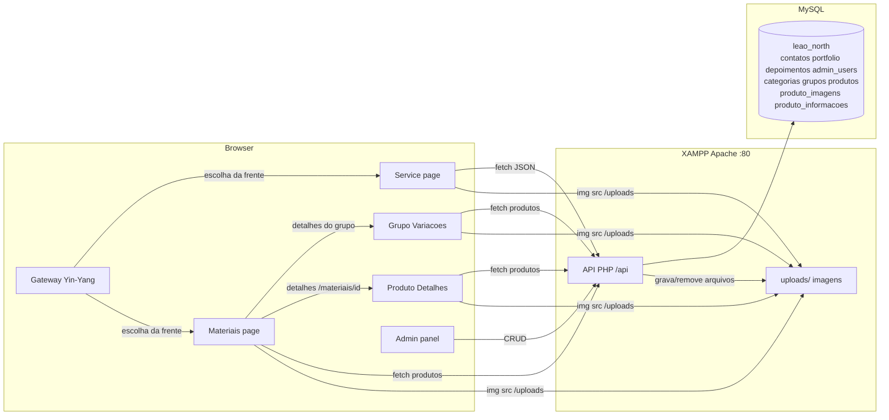

# CONTEXT — Leão North (Instalações Elétricas + Materiais)

> **Para quem é este documento:** outra IA (ou desenvolvedor) que receber acesso a este projeto
> precisa entender, em poucos minutos, **o que** o aplicativo faz, **como** está arquitetado,
> **como funciona** e **o que há em cada arquivo**.

---

## 1. Visão Geral do Aplicativo

A **Leão North** é uma empresa de engenharia elétrica com sede em **Cornélio Procópio - PR**
(R. Paraíba, 830 - Centro). O domínio principal atende **duas frentes de negócio** no mesmo SPA
(conceito "Yin-Yang"):

1. **Leão North Service** — serviços elétricos (tema escuro). Apresenta a empresa, serviços,
   portfólio, depoimentos, sócios e formulário de orçamento.
2. **Leão North Materiais** — catálogo de produtos elétricos para venda casada (tema claro).
   Produtos com **múltiplas imagens** (com capa), descrição longa e informações adicionais
   (chave/valor). O interesse é encaminhado via WhatsApp e há uma **página de detalhes** por produto
   com galeria, zoom ("lupa") e CTA de venda.

> **Versão 2.0 (modelo relacional):** o catálogo de Materiais evoluiu de "strings soltas" para um
> modelo **relacional**: as **Categorias** e os **Grupos** (famílias de produtos, ex.: *Painel de Led
> Quadrado*) são agora **entidades no banco** (tabelas `categorias` e `grupos`), cada grupo com
> **1 capa exclusiva** (`caminho_imagem_capa`), e os produtos referenciam **IDs** (`categoria_id` e
> `grupo_id`) em vez de textos. A **vitrine** agrupa produtos por grupo (1 card por família) e o
> **painel admin** foi seccionado em **"Leão Materiais"** (Categorias, Grupos, Produtos) ×
> **"Leão Service"** (Portfólio, Depoimentos) × **Geral** (Mensagens).

> **Fases 20–21 (UI/UX da vitrine Materiais):** a frente "Leão Materiais" passou a ter experiência
> **própria e separada** da institucional. A **Fase 20** criou o header exclusivo
> ([`HeaderMateriais.tsx`](leao-north-site/client/src/components/HeaderMateriais.tsx)) com **busca
> global** (Enter → `/materiais?q=...`, lida via `window.location.search`), footer enxuto
> ([`FooterMateriais.tsx`](leao-north-site/client/src/components/FooterMateriais.tsx)) e **sidebar
> vertical de categorias** (desktop sticky / `Sheet` off-canvas no mobile). A **Fase 21** adicionou
> **ordenação** (Padrão/A–Z/Z–A), **breadcrumbs** e **estado vazio persuasivo** com CTA de WhatsApp.
> As rotas do catálogo (`/materiais*`) **não herdam** mais o menu institucional — o Service segue com
> `Navbar`/`Footer`. Planejamentos: [`fase20_vitrine_ux.md`](zoo_code_docs/fase20_vitrine_ux.md) e
> [`fase21_vitrine_refinamentos.md`](zoo_code_docs/fase21_vitrine_refinamentos.md).

A experiência começa no **Portal Gateway** (split-screen), onde o visitante escolhe entre
**Service** e **Materiais**. Há também o **Painel Administrativo** (`/admin`), que permite gerenciar
portfólio, **categorias**, **grupos** (com upload de capa), **produtos (criar, editar, excluir e
duplicar)**, mensagens e depoimentos.

O site é um **SPA em React** que roda na pasta do **XAMPP** (`c:/xampp/htdocs/leaonorth`) e conversa
com uma **API em PHP** servida pelo Apache do XAMPP, persistindo dados em **MySQL**.

---

## 2. Stack Tecnológica

| Camada | Tecnologia |
| --- | --- |
| Frontend | React 19 + TypeScript + Vite 7 |
| Estilo | Tailwind CSS 4 + shadcn/ui (Radix UI) + tw-animate-css |
| Roteamento | Wouter 3 (client-side routing; rotas dinâmicas `/materiais/:id` e `/materiais/grupo/:id`). ⚠️ `useLocation` retorna **apenas o pathname** — query string lida via `window.location.search` (ver §10.13) |
| Animações | CSS + IntersectionObserver (scroll reveal) + tw-animate-css (Gateway) + zoom CSS (transform-origin) |
| Backend | PHP 8 (PDO/MySQL) servido pelo Apache do XAMPP |
| Banco de dados | MySQL — database `leao_north` |
| Upload de imagens | PHP `move_uploaded_file` → pasta `uploads/` (validação MIME real via `finfo` + 5MB) |
| Ícones | lucide-react |
| Fonte | Barlow Condensed (títulos) + DM Sans (corpo), via Google Fonts |
| Gerenciador de pacotes | pnpm (também há `package-lock.json`) |

> **Importante:** o frontend e o backend **não** rodam juntos no mesmo processo. O backend PHP
> (`/api/...`) é servido pelo **Apache do XAMPP** em `http://localhost/leaonorth/api/...`, e o
> frontend (Vite dev server, porta 3000) faz requisições `fetch` para essas URLs absolutas.

---

## 3. Arquitetura Geral



### Fluxo de dados principal

1. O usuário acessa `/` → o **Portal Gateway** exibe as duas frentes (Service escuro / Materiais claro).
2. Escolhe **Service** (`/service`): landing compõe Hero, About, Mission, Services, Portfolio,
   Differentials, **Sócios**, Testimonials e Contact. Seções dinâmicas (Portfólio, Depoimentos)
   buscam dados via `fetch` para a API PHP.
3. Escolhe **Materiais** (`/materiais`): catálogo claro consumindo `api/produtos.php`. A **vitrine é
   agrupada** (Fases 13/19): produtos com `grupo_id` viram **1 card de grupo** (capa oficial do grupo
   = `grupo_capa`), e produtos sem grupo aparecem como cards individuais. A página usa **Header/
   Footer exclusivos** (Fase 20) e oferece **busca global** (`?q=`), **sidebar de categorias**
   (desktop/Sheet mobile), **ordenação** Padrão/A–Z/Z–A, **breadcrumbs** e **estado vazio com CTA de
   WhatsApp** (Fases 20/21).
4. Clica em **"Ver Opções"** de um grupo → **`/materiais/grupo/:id`** (`GrupoVariacoes.tsx`): lista as
   variações (produtos) daquele `grupo_id` com o card individual.
5. Clica em um produto (individual ou variação) → **`/materiais/:id`** (`ProdutoDetalhes.tsx`):
   galeria com zoom (lupa), descrição, informações adicionais e CTA "Tenho Interesse".
6. O visitante envia um formulário (orçamento, contato ou "falar com sócio") → `POST /api/contato.php`
   → grava em `contatos` com `tipo_mensagem` (service | materiais | socio) e tenta disparar e-mail
   para `contato@leaonorth.com.br`.
7. O administrador acessa `/admin` (login) → token no `localStorage` → `/admin/dashboard`. O painel
   tem **sidebar seccionado** ("Leão Materiais": Categorias/Grupos/Produtos · "Leão Service":
   Portfólio/Depoimentos · "Geral": Mensagens) para gerenciar **categorias**, **grupos (com capa)**,
   **produtos (criar/editar/excluir/duplicar, múltiplas imagens + capa + informações)** em listagem
   com **drill-down em pastas**, além de mensagens (badges de origem) e depoimentos.

---

## 4. Estrutura de Diretórios

```
leaonorth/                          ← raiz do workspace (document root do site no XAMPP)
├── CONTEXT.md                      ← este documento
├── .gitignore
│
├── api/                            ← BACKEND PHP (usado de verdade pelo frontend)
│   ├── contato.php                 ← POST: salva contato/orçamento + tipo_mensagem + e-mail
│   ├── portfolio.php               ← GET: lista projetos do portfólio
│   ├── depoimentos.php             ← GET: lista depoimentos
│   ├── categorias.php              ← GET: lista categorias (relacional v2.0)
│   ├── grupos.php                  ← GET: lista grupos (com categoria_nome, capa e total de produtos)
│   ├── produtos.php                ← GET: lista produtos (LEFT JOIN categoria/grupo + imagens[]/informacoes[])
│   ├── migracao_v2.sql             ← DDL + backfill da migração para o modelo relacional (Fase 15)
│   └── admin/
│       ├── login.php               ← POST: autentica admin (password_verify)
│       ├── mensagens.php           ← GET: lista mensagens de contato (inclui tipo_mensagem)
│       ├── add_depoimento.php      ← POST: cria depoimento
│       ├── edit_depoimento.php     ← PUT: edita depoimento
│       ├── delete_depoimento.php   ← DELETE: remove depoimento
│       ├── upload.php              ← POST: upload de imagem + insere no portfólio
│       ├── delete.php              ← DELETE: remove projeto do portfólio
│       ├── add_categoria.php       ← POST: cria categoria
│       ├── edit_categoria.php      ← POST: edita categoria
│       ├── delete_categoria.php    ← DELETE: remove categoria (409 se tiver grupos)
│       ├── add_grupo.php           ← POST: cria grupo (nome, categoria_id, capa única obrigatória)
│       ├── edit_grupo.php          ← POST: edita grupo (nome, categoria_id, capa opcional)
│       ├── delete_grupo.php        ← DELETE: remove grupo + capa física (produtos ficam sem grupo)
│       ├── add_produto.php         ← POST: cadastra produto (categoria_id/grupo_id + múltiplas imagens; MIME/5MB)
│       ├── edit_produto.php        ← POST: edita produto (imagens mantidas + novas; capa combinada)
│       ├── duplicate_produto.php   ← POST: duplica produto (copia dados + ARQUIVOS FÍSICOS via copy())
│       └── delete_produto.php      ← DELETE: remove produto (CASCADE) + todas as imagens físicas
│
├── uploads/                        ← imagens (portfólio, produtos e capas de grupos)
│
├── zoo_code_docs/                  ← documentação de planejamento das fases (fase1..fase21)
│
└── leao-north-site/                ← FRONTEND React (código-fonte do site)
    ├── package.json                ← dependências e scripts
    ├── vite.config.ts              ← config do Vite (alias, plugins, debug logs)
    ├── tsconfig.json               ← config TypeScript (alias @, @shared)
    ├── components.json             ← config shadcn/ui
    ├── index.html (client/)        ← HTML raiz (metas SEO + fontes)
    ├── client/
    │   ├── public/__manus__/       ← debug collector do Manus (dev tooling)
    │   └── src/
    │       ├── main.tsx            ← entry point React
    │       ├── App.tsx             ← rotas (/, /service, /materiais, /materiais/grupo/:id, /materiais/:id, /admin, /admin/dashboard, /404)
    │       ├── index.css           ← design system (cores/tipografia/utilitários)
    │       ├── const.ts            ← constantes OAuth (não usado no fluxo atual)
    │       ├── pages/
    │       │   ├── Gateway.tsx     ← Portal Yin-Yang (escolha Service × Materiais)
    │       │   ├── Service.tsx     ← landing da Leão North Service (ex-Home)
    │       │   ├── Materiais.tsx   ← vitrine Materiais (Fases 13/19/20/21): busca global, sidebar de categorias, ordenação, breadcrumbs, estado vazio com CTA
    │       │   ├── GrupoVariacoes.tsx ← página de variações de um grupo (/materiais/grupo/:id)
    │       │   ├── ProdutoDetalhes.tsx ← página de detalhes do produto (galeria + zoom/lupa)
    │       │   ├── NotFound.tsx    ← página 404
    │       │   └── admin/
    │       │       ├── Login.tsx   ← tela de login do painel
    │       │       └── Dashboard.tsx ← painel seccionado (categorias/grupos/produtos/portfólio/mensagens/depoimentos)
    │       ├── components/
    │       │   ├── HeaderMateriais.tsx ← header EXCLUSIVO da frente Materiais (Fase 20: logo, busca global, Início/Contato; sem menu institucional)
    │       │   ├── FooterMateriais.tsx ← rodapé enxuto da frente Materiais (Fase 20: logo, redes sociais, direitos)
    │       │   ├── Navbar.tsx      ← navbar institucional fixa com blur; prop variant="dark" | "light" (usada APENAS pelo Service)
    │       │   ├── Footer.tsx      ← rodapé escuro institucional (usado APENAS pelo Service)
    │       │   ├── WhatsAppButton.tsx ← botão flutuante do WhatsApp
    │       │   ├── ErrorBoundary.tsx ← captura erros de renderização
    │       │   ├── ProdutoCard.tsx ← card de produto compartilhado (mini-carrossel; usado em Materiais e GrupoVariacoes)
    │       │   ├── Map.tsx         ← componente Google Maps (do template; NÃO usado)
    │       │   ├── ManusDialog.tsx ← dialog de login do Manus (do template; NÃO usado)
    │       │   ├── sections/       ← seções da landing Service
    │       │   │   ├── HeroSection.tsx, AboutSection.tsx, MissionSection.tsx,
    │       │   │   ├── ServicesSection.tsx, PortfolioSection.tsx, DifferentialsSection.tsx,
    │       │   │   ├── SociosSection.tsx, TestimonialsSection.tsx, ContactSection.tsx
    │       │   └── ui/             ← ~50 componentes shadcn/ui (biblioteca padrão)
    │       ├── contexts/
    │       │   └── ThemeContext.tsx ← provider de tema claro/escuro (app usa dark)
    │       ├── hooks/
    │       │   ├── useScrollReveal.ts ← hook de reveal ao rolar
    │       │   ├── useComposition.ts  ← util para inputs (template)
    │       │   ├── useMobile.tsx      ← detecta mobile (template)
    │       │   └── usePersistFn.ts    ← função estável (template)
    │       └── lib/
    │           └── utils.ts        ← helper `cn()` (clsx + tailwind-merge)
    ├── server/index.ts             ← servidor Express placeholder (template; NÃO usado)
    ├── shared/const.ts             ← constantes compartilhadas (template)
    ├── patches/wouter@3.7.1.patch  ← patch do wouter (registra rotas no window)
    ├── ideas.md                    ← brainstorm de design (documentação)
    ├── template.json               ← manifest do template usado para criar o site
    └── README.md                   ← readme do template
```

---

## 5. Backend PHP — Endpoints (raiz `/api`)

> Todos os endpoints usam **PDO** com credenciais do XAMPP local: host `localhost`, database
> `leao_north`, user `root`, senha vazia. Todos liberam **CORS**
> (`Access-Control-Allow-Origin: *`) e respondem **JSON**.

### Catálogo relacional (Versão 2.0)

| Endpoint | Método | O que faz | Retorno |
| --- | --- | --- | --- |
| [`api/contato.php`](api/contato.php) | POST | Valida `name`, `phone`, `message`; insere em `contatos` **incluindo `tipo_mensagem`** (whitelist `service`/`materiais`/`socio`, default `service`); tenta enviar e-mail com a origem | `200/400/500/503` + `mensagem` |
| [`api/portfolio.php`](api/portfolio.php) | GET | `SELECT id, img, title, category, size FROM portfolio ORDER BY id DESC` | array JSON |
| [`api/depoimentos.php`](api/depoimentos.php) | GET | `SELECT id, nome, estrelas, texto FROM depoimentos ORDER BY id DESC` | array JSON |
| [`api/categorias.php`](api/categorias.php) | GET | Lista `categorias` (`id, nome ORDER BY nome`) — usada pela vitrine e pelo painel | array JSON |
| [`api/grupos.php`](api/grupos.php) | GET | Lista `grupos` com `categoria_id`/`categoria_nome` (JOIN), `caminho_imagem_capa` e `total_produtos` (COUNT); filtro opcional `?categoria_id=` | array JSON |
| [`api/produtos.php`](api/produtos.php) | GET | Lista produtos com **`LEFT JOIN`** de `categorias`/`grupos` (expondo `categoria_id`/`categoria_nome`/`grupo_id`/`grupo_nome`/`grupo_capa`), `descricao` e **arrays aninhados** `imagens[]`/`informacoes[]` (3 queries com `IN (ids)`, sem N+1); filtros `?categoria_id=`/`?grupo_id=` | array JSON |
| [`api/admin/login.php`](api/admin/login.php) | POST | Busca usuário por e-mail em `admin_users`; confere senha com `password_verify` | `200` com `token` ou `401` |
| [`api/admin/mensagens.php`](api/admin/mensagens.php) | GET | Lista `contatos` **incluindo `tipo_mensagem`** (id, nome, telefone, email, servico, mensagem, tipo_mensagem, data_envio) | array JSON |
| [`api/admin/add_depoimento.php`](api/admin/add_depoimento.php) | POST | Insere em `depoimentos` (nome, estrelas, texto — texto opcional) | `200`/`500` |
| [`api/admin/edit_depoimento.php`](api/admin/edit_depoimento.php) | PUT | `UPDATE depoimentos SET nome, estrelas, texto WHERE id` | `200`/`400`/`500` |
| [`api/admin/delete_depoimento.php`](api/admin/delete_depoimento.php) | DELETE | `DELETE FROM depoimentos WHERE id` (id via query string) | `200`/`500` |
| [`api/admin/upload.php`](api/admin/upload.php) | POST | Recebe imagem (`$_FILES['image']`) + `title`/`category`/`size`; salva em `../../uploads/` com nome `time()_nome`; insere `img` (`/uploads/...`) no `portfolio` | `200`/`400`/`500` |
| [`api/admin/delete.php`](api/admin/delete.php) | DELETE | `DELETE FROM portfolio WHERE id` (id via query string) | `200`/`500` |
| [`api/admin/add_categoria.php`](api/admin/add_categoria.php) | POST | Cria `categorias` (`nome`, UNIQUE); `409` em duplicidade | `200`/`400`/`409`/`500` |
| [`api/admin/edit_categoria.php`](api/admin/edit_categoria.php) | POST | `UPDATE categorias SET nome WHERE id` | `200`/`400`/`409`/`500` |
| [`api/admin/delete_categoria.php`](api/admin/delete_categoria.php) | DELETE | `DELETE FROM categorias WHERE id`; `409` se houver grupos (FK `RESTRICT`) | `200`/`400`/`409`/`500` |
| [`api/admin/add_grupo.php`](api/admin/add_grupo.php) | POST | Cria `grupos` (`nome`, `categoria_id`) + **1 capa obrigatória** (`$_FILES['capa']`, MIME real + 5MB); `409` em duplicidade na categoria | `200`/`400`/`409`/`500` |
| [`api/admin/edit_grupo.php`](api/admin/edit_grupo.php) | POST | Edita `grupos` (`nome`, `categoria_id`); capa nova (substitui/`unlink` antiga) ou `remover_capa=1` | `200`/`400`/`404`/`409`/`500` |
| [`api/admin/delete_grupo.php`](api/admin/delete_grupo.php) | DELETE | Exclui `grupos` + `unlink` da capa; produtos ficam sem grupo (`ON DELETE SET NULL`) | `200`/`400`/`500` |
| [`api/admin/add_produto.php`](api/admin/add_produto.php) | POST | Cadastra produto (**`categoria_id` obrigatório**, `grupo_id` opcional, `descricao`) com **1 a 8 imagens** (`$_FILES['imagens']`), `capa_index`, `informacoes` (JSON) — transação, MIME real (`finfo`) e 5MB | `200`/`400`/`500` |
| [`api/admin/edit_produto.php`](api/admin/edit_produto.php) | POST | **Edita** produto (`categoria_id`/`grupo_id`); `imagens_mantidas` (JSON) + `novas_imagens` (`$_FILES`); exclui removidas (banco + `unlink`); capa pela lista combinada; informações deletadas/reinseridas — transação | `200`/`400`/`500` |
| [`api/admin/duplicate_produto.php`](api/admin/duplicate_produto.php) | POST | **Duplica** produto: `SELECT` completo (produto + imagens + informações) → `INSERT` novo com nome `" (Cópia)"` herdando `categoria_id`/`grupo_id`; **copia fisicamente os arquivos** de imagem via `copy()` (novos nomes `time()_indice_nome`) — transação + rollback com `unlink` | `200` (com `id`) /`400`/`404`/`500` |
| [`api/admin/delete_produto.php`](api/admin/delete_produto.php) | DELETE | Resgata **todas** as imagens de `produto_imagens` antes do `DELETE FROM produtos` (FKs `ON DELETE CASCADE`); faz `unlink` de todos os arquivos | `200`/`400`/`500` |

### Sobre o campo `tipo_mensagem`

- **`contato.php`**: aceita `tipo_mensagem` no payload JSON e valida com whitelist
  (`service`, `materiais`, `socio`); se ausente/inválido, usa `service`. A origem também é incluída
  no corpo do e-mail de notificação.
- **`mensagens.php`**: o `SELECT` retorna `tipo_mensagem` para o painel exibir o badge de origem.

### Observações de segurança/qualidade (importantes para quem for mexer)

- **Login "frouxo":** o token (`base64(id + time())`) é guardado apenas no `localStorage`; **nenhum
  endpoint de admin valida de fato esse token** no servidor. A "proteção" é client-side.
- **Injeção SQL:** todas as queries usam prepared statements (`bindParam`/`bindValue`) — ok.
- **Upload:** `add_produto.php`, `edit_produto.php`, `add_grupo.php` e `edit_grupo.php` validam
  **MIME real via `finfo`** e **5MB**; `upload.php` do portfólio continua sem validação no servidor
  (apenas `accept="image/*"`).
- **Conexão:** credenciais do banco hardcoded (padrão XAMPP: root/senha vazia).
- **Duplicação:** `duplicate_produto.php` usa `copy()` para criar **arquivos independentes** das
  imagens, para que excluir o original não afete a cópia.

---

## 6. Frontend React — Arquivos Principais

### Entrada e rotas

- [`client/src/main.tsx`](leao-north-site/client/src/main.tsx) — monta o `<App />` no `#root`.
- [`client/src/App.tsx`](leao-north-site/client/src/App.tsx) — define o `Router` (wouter `Switch`):
  - `/` → **`Gateway`** (Portal Yin-Yang)
  - `/service` → **`Service`**
  - `/materiais` → **`Materiais`** (vitrine agrupada)
  - `/materiais/grupo/:id` → **`GrupoVariacoes`** (variações de um grupo, por ID)
  - `/materiais/:id` → **`ProdutoDetalhes`** (rota dinâmica)
  - `/admin` → `Login`
  - `/admin/dashboard` → `Dashboard`
  - qualquer outra → `NotFound`
  - Envolve tudo com `ErrorBoundary`, `ThemeProvider` (tema escuro) e `Toaster` (sonner).

### Páginas

| Página | Função |
| --- | --- |
| [`Gateway.tsx`](leao-north-site/client/src/pages/Gateway.tsx) | **Portal de escolha (Yin-Yang):** tela dividida em duas metades (lado a lado no desktop, empilhada no mobile). Lado esquerdo **Service** (fundo `#080808`, dourado, → `/service`) e lado direito **Materiais** (fundo claro `#F8FAFC`, dourado, → `/materiais`). Animações de entrada com `tw-animate-css` e hover com anel de brilho dourado + zoom. Não usa Navbar/Footer. |
| [`Service.tsx`](leao-north-site/client/src/pages/Service.tsx) | **Leão North Service** (ex-`Home`): compõe `Navbar` → `Hero` → `About` → `Mission` → `Services` → `Portfolio` → `Differentials` → **`SociosSection`** → `Testimonials` → `Contact` → `Footer` → `WhatsAppButton`. Fundo geral `#080808`. |
| [`Materiais.tsx`](leao-north-site/client/src/pages/Materiais.tsx) | **Leão North Materiais (tema claro) — vitrine agrupada (Fases 13/19) + UX de conversão (Fases 20/21):** consumindo `api/produtos.php`, um `useMemo` separa a lista em **cards de grupo** (agrupados por `grupo_id`, título = `grupo_nome`, capa = **`grupo_capa`** oficial, badge "X opções disponíveis" e botão **"Ver Opções"** → `/materiais/grupo/:id`) e **cards individuais** (produtos sem grupo). Usa **Header exclusivo** (`HeaderMateriais`, com **busca global** `?q=` lida via `window.location.search`) e **Footer enxuto** (`FooterMateriais`); **sidebar vertical** de categorias (desktop sticky `w-64` / `Sheet` off-canvas no mobile), **ordenação** Padrão/A–Z/Z–A, **breadcrumbs** (`Início > Catálogo > Categoria`) e **estado vazio persuasivo** com CTA verde de WhatsApp `#25D366`. |
| [`GrupoVariacoes.tsx`](leao-north-site/client/src/pages/GrupoVariacoes.tsx) | **Variações de um grupo** (`/materiais/grupo/:id`): lê o `id` da URL, filtra os produtos por `grupo_id` (client-side) e exibe cada variação com o `ProdutoCard` individual; cabeçalho com `categoria_nome`/`grupo_nome` (nomes oficiais). Usa `HeaderMateriais`/`FooterMateriais` e **breadcrumb** `Início > Catálogo > Categoria > Grupo` (Fase 21). |
| [`ProdutoDetalhes.tsx`](leao-north-site/client/src/pages/ProdutoDetalhes.tsx) | **Detalhes do produto** (`/materiais/:id`): busca produto por `id` em `api/produtos.php`; **galeria** (foto principal + miniaturas + setas, capa por padrão) com **efeito de zoom "lupa"** (hover desktop: `scale(2)` + `transform-origin` no cursor, ícone `ZoomIn`); **descrição** com `whitespace-pre-line`; **informações adicionais** em tabela; **CTA gigante "Tenho Interesse"** (WhatsApp verde `#25D366`). Usa `HeaderMateriais`/`FooterMateriais` (Fase 20). |
| [`NotFound.tsx`](leao-north-site/client/src/pages/NotFound.tsx) | Página 404. |

### Seções (components/sections) — usadas pelo `Service`

| Arquivo | Conteúdo |
| --- | --- |
| [`HeroSection.tsx`](leao-north-site/client/src/components/sections/HeroSection.tsx) | Hero assimétrico: badge, título, CTAs (WhatsApp + scroll), estatísticas, imagem com clip-path diagonal |
| [`AboutSection.tsx`](leao-north-site/client/src/components/sections/AboutSection.tsx) | "Quem Somos": imagem, badge 10+ anos, texto institucional, 4 destaques |
| [`MissionSection.tsx`](leao-north-site/client/src/components/sections/MissionSection.tsx) | 3 cards: Missão, Visão e Valores |
| [`ServicesSection.tsx`](leao-north-site/client/src/components/sections/ServicesSection.tsx) | Grid com 7 serviços + card CTA "Solicite um Orçamento" |
| [`PortfolioSection.tsx`](leao-north-site/client/src/components/sections/PortfolioSection.tsx) | Busca projetos via `api/portfolio.php`, galeria com lightbox |
| [`DifferentialsSection.tsx`](leao-north-site/client/src/components/sections/DifferentialsSection.tsx) | Lista vertical numerada (01–05) de diferenciais |
| [`SociosSection.tsx`](leao-north-site/client/src/components/sections/SociosSection.tsx) | **2 cards de sócios** (Igor Busquim de Moraes — Diretor Executivo; Rafael — Diretor Técnico; fotos em `/uploads/`). Botão "Falar com [Nome]" abre um **mini-formulário** que envia `POST` para `api/contato.php` com **`tipo_mensagem: "socio"`** |
| [`TestimonialsSection.tsx`](leao-north-site/client/src/components/sections/TestimonialsSection.tsx) | Busca depoimentos via `api/depoimentos.php`, calcula média de estrelas; se vazio, fica oculta |
| [`ContactSection.tsx`](leao-north-site/client/src/components/sections/ContactSection.tsx) | Info de contato, CTA WhatsApp, formulário de orçamento (`POST api/contato.php`) e mapa (iframe) |

> **Padrão comum nas seções:** cada seção usa `IntersectionObserver` para aplicar `.reveal`
> (fade-up com stagger), definido no [`index.css`](leao-north-site/client/src/index.css).
> A página Materiais **não** usa scroll reveal nos cards (renderização direta).

### Componentes compartilhados

- [`HeaderMateriais.tsx`](leao-north-site/client/src/components/HeaderMateriais.tsx) — **header
  EXCLUSIVO da frente Materiais (Fase 20)**, renderizado apenas nas rotas `/materiais*`. Logo "Leão"
  → `/` (hub Gateway), **busca global** no centro (Enter → `/materiais?q=...`; termo vazio →
  `/materiais`), links "Catálogo" (→ `/materiais`) e "Contato" (WhatsApp). **Não herda** o menu
  institucional. Tema claro + dourado; no mobile a lupa abre a busca em linha.
- [`FooterMateriais.tsx`](leao-north-site/client/src/components/FooterMateriais.tsx) — **rodapé
  enxuto da frente Materiais (Fase 20)**: logo, redes sociais e direitos (sem âncoras
  institucionais). Fundo escuro `#060606`.
- [`Navbar.tsx`](leao-north-site/client/src/components/Navbar.tsx) — fixa, ganha blur ao rolar,
  menu mobile hambúrguer, links âncora (Início, Sobre, Serviços, Portfólio, **Sócios**, Depoimentos,
  Contato). **Usada APENAS pelo Service** (`variant="light"` deixou de ser usada nas páginas do
  catálogo, que agora usam `HeaderMateriais`).
- [`Footer.tsx`](leao-north-site/client/src/components/Footer.tsx) — rodapé escuro institucional com
  colunas de marca, links, serviços e contato. **Usado APENAS pelo Service** (o catálogo usa
  `FooterMateriais`).
- [`WhatsAppButton.tsx`](leao-north-site/client/src/components/WhatsAppButton.tsx) — botão flutuante
  verde com pulso, link `https://wa.me/5543999190467`.
- [`ProdutoCard.tsx`](leao-north-site/client/src/components/ProdutoCard.tsx) — **card de produto
  compartilhado** (extraído na Fase 13): mini-carrossel de imagens (capa no índice 0), `categoria_nome`,
  nome, especificação e botões "Mais Detalhes" e "Tenho Interesse". Exporta o tipo `Produto` (campos
  relacionais `categoria_id`/`categoria_nome`/`grupo_id`/`grupo_nome`/`grupo_capa`) e o helper
  `normalizarImagens`. Usado em [`Materiais.tsx`](leao-north-site/client/src/pages/Materiais.tsx) e
  [`GrupoVariacoes.tsx`](leao-north-site/client/src/pages/GrupoVariacoes.tsx).
- [`ErrorBoundary.tsx`](leao-north-site/client/src/components/ErrorBoundary.tsx) — captura erros e
  mostra tela com stack + "Reload Page".
- [`Map.tsx`](leao-north-site/client/src/components/Map.tsx) e
  [`ManusDialog.tsx`](leao-north-site/client/src/components/ManusDialog.tsx) — do template; **não
  usados** no fluxo atual.
- [`components/ui/`](leao-north-site/client/src/components/ui/) — biblioteca **shadcn/ui** padrão
  (~50 componentes). A landing usa classes Tailwind próprias; o admin usa componentes simples.

### Admin

- [`client/src/pages/admin/Login.tsx`](leao-north-site/client/src/pages/admin/Login.tsx) — tela de
  login. Envia `POST` para `api/admin/login.php`; em sucesso salva `admin_token` no `localStorage`.
- [`client/src/pages/admin/Dashboard.tsx`](leao-north-site/client/src/pages/admin/Dashboard.tsx) —
  painel com **sidebar seccionado** (labels por área) e abas:
  - **LEÃO MATERIAIS:**
    - **Categorias** (Fase 16): formulário (nome) + tabela com Editar/Excluir → `categorias.php`,
      `add/edit/delete_categoria.php`.
    - **Grupos** (Fase 17): formulário (nome + select categoria + **upload da capa** com preview
      via `URL.createObjectURL`) + tabela com miniatura/nome/categoria/ações → `grupos.php`,
      `add/edit/delete_grupo.php`.
    - **Produtos** (Fases 6/7/9/12/14/18): formulário rico com **selects de Categoria e Grupo**
      (relacional — grupo filtrado pela categoria selecionada), múltiplas fotos com seletor de capa,
      descrição e informações dinâmicas; envia `categoria_id`/`grupo_id` + `imagens[]`/`capa_index`/
      `informacoes` (ou `novas_imagens[]` + `imagens_mantidas`). Ações por card: **Editar**, **Duplicar**
      (ícone `Copy`, Fase 12) e **Excluir**. A **listagem é em "pastas"** (drill-down, Fase 14): produtos
      com grupo viram pasta (capa `grupo_capa`) com "Ver Variações"; produtos sem grupo aparecem
      individualmente.
  - **LEÃO SERVICE:**
    - **Portfólio/Serviços:** upload (título, categoria, tamanho, imagem) → `upload.php`; lista +
      excluir → `delete.php`.
    - **Depoimentos:** criar/editar (add/edit) e excluir → `delete_depoimento.php`.
  - **GERAL:**
    - **Mensagens:** tabela de mensagens → `mensagens.php`, com **badge de `tipo_mensagem`**
      (Service = dourado, Materiais = azul, Sócio = roxo) também presente no modal de leitura.
  - Redireciona para `/admin` se não existir `admin_token`.

### Contextos, hooks e utilitários

- [`contexts/ThemeContext.tsx`](leao-north-site/client/src/contexts/ThemeContext.tsx) — provider de
  tema (app usa `defaultTheme="dark"`; não é `switchable`). O tema claro da página Materiais é
  aplicado **localmente** via classes, sem alterar o provider global.
- [`hooks/useScrollReveal.ts`](leao-north-site/client/src/hooks/useScrollReveal.ts) — hook de reveal
  ao rolar (as seções implementam a lógica inline com `IntersectionObserver`).
- [`hooks/useComposition.ts`](leao-north-site/client/src/hooks/useComposition.ts),
  [`hooks/useMobile.tsx`](leao-north-site/client/src/hooks/useMobile.tsx),
  [`hooks/usePersistFn.ts`](leao-north-site/client/src/hooks/usePersistFn.ts) — utilitários do template.
- [`lib/utils.ts`](leao-north-site/client/src/lib/utils.ts) — exporta `cn()`.

### Design system (`client/src/index.css`)

- Paleta **"Tech Engineering Dark Gold"**: preto `#080808` + dourado `#F0B429` + branco.
- Tokens via `oklch` (`--primary`, `--gold`, etc.); utilitários customizados: `.text-gold-gradient`,
  `.gold-glow`, `.reveal`, `.service-card`, `.navbar-scrolled`, `.wa-pulse`, `.stagger-children`.
- Tipografia: `Barlow Condensed` (títulos) e `DM Sans` (corpo).
- O **tema claro** da página Materiais usa classes do Tailwind (ex.: `bg-slate-50`, `text-slate-900`)
  diretamente, mantendo os destaques no dourado da marca.

### Fontes e SEO (`client/index.html`)

- `lang="pt-BR"`, título "Leão North — Instalações Elétricas e Engenharia Elétrica", meta tags de
  SEO/OG e link canônico `https://leaonorth.com.br`.
- Google Fonts: `Barlow+Condensed` e `DM+Sans`.

---

## 7. Banco de Dados — Database `leao_north`

O schema foi migrado para o **modelo relacional (Versão 2.0)** na Fase 15. O DDL completo (criação de
`categorias`/`grupos`, `ALTER TABLE produtos` e **backfill** dos dados existentes) está em
[`api/migracao_v2.sql`](api/migracao_v2.sql). **Pendência manual:** executar o `DROP COLUMN` das
colunas antigas de texto após validar a vitrine
(`ALTER TABLE produtos DROP COLUMN categoria, DROP COLUMN grupo;`).

| Tabela | Colunas | Usada por |
| --- | --- | --- |
| `contatos` | `id`, `nome`, `telefone`, `email`, `servico`, `mensagem`, **`tipo_mensagem`** (ENUM `service`/`materiais`/`socio`, default `service`), `data_envio` | `contato.php` (insert), `mensagens.php` (select) |
| `portfolio` | `id`, `img`, `title`, `category`, `size` | `portfolio.php` (select), `upload.php` (insert), `delete.php` (delete) |
| `depoimentos` | `id`, `nome`, `estrelas`, `texto` | `depoimentos.php` (select), `add_depoimento.php`/`edit_depoimento.php` (insert/update), `delete_depoimento.php` (delete) |
| `categorias` | `id`, `nome` (UNIQUE) | `categorias.php` (select), `add_categoria.php`/`edit_categoria.php` (insert/update), `delete_categoria.php` (delete) |
| `grupos` | `id`, `nome`, `categoria_id` (FK → `categorias` `ON DELETE RESTRICT`), `caminho_imagem_capa` (capa exclusiva) — UNIQUE `(categoria_id, nome)` | `grupos.php` (select), `add_grupo.php`/`edit_grupo.php` (insert/update), `delete_grupo.php` (delete) |
| `produtos` | `id`, `nome`, `especificacao`, **`descricao`** (TEXT), `categoria_id` (FK → `categorias` `ON DELETE SET NULL`), `grupo_id` (FK → `grupos` `ON DELETE SET NULL`), `data_cadastro` — (colunas legadas de texto `categoria`/`grupo` ainda presentes até o `DROP` manual) | `produtos.php` (select + LEFT JOIN), `add_produto.php`/`edit_produto.php`/`duplicate_produto.php` (insert/update), `delete_produto.php` (delete) |
| `produto_imagens` | `id`, `produto_id` (FK `ON DELETE CASCADE`), `caminho_imagem`, `is_capa` (TINYINT 0/1), `ordem` | `add_produto.php`/`edit_produto.php` (insert/update), `produtos.php` (select), `delete_produto.php`/`duplicate_produto.php` (delete/copy) |
| `produto_informacoes` | `id`, `produto_id` (FK `ON DELETE CASCADE`), `titulo`, `texto` | `add_produto.php`/`edit_produto.php`/`duplicate_produto.php` (insert/delete), `produtos.php` (select) |
| `admin_users` | `id`, `email`, `password` | `login.php` (select + `password_verify`) |

> **Nota:** a senha do admin deve ser gerada com `password_hash()` (ex.: `password_hash('123456',
> PASSWORD_DEFAULT)`). Não há script de seed no repo. As tabelas `categorias`/`grupos` e as colunas
> `categoria_id`/`grupo_id` em `produtos` foram criadas na Fase 15 (DDL em [`api/migracao_v2.sql`](api/migracao_v2.sql)).

---

## 8. Como Rodar Localmente (XAMPP)

1. **Apache + MySQL** do XAMPP ligados.
2. Criar o banco `leao_north` e as tabelas da §7 (no phpMyAdmin): `contatos` (com `tipo_mensagem`),
   `portfolio`, `depoimentos`, `categorias`, `grupos`, `produtos`, `produto_imagens`,
   `produto_informacoes` e `admin_users`. Para **bases já existentes**, executar
   [`api/migracao_v2.sql`](api/migracao_v2.sql) (cria `categorias`/`grupos` e faz o backfill) e, por
   fim, o `DROP COLUMN` manual das colunas antigas.
3. Colocar o projeto em `C:\xampp\htdocs\leaonorth` (já é a raiz do workspace).
4. A API PHP fica em `http://localhost/leaonorth/api/...` (testar no navegador).
5. Frontend:
   ```bash
   cd leao-north-site
   pnpm install   # ou npm install
   pnpm dev       # sobe o Vite em http://localhost:3000
   ```
   > O frontend **não funciona sozinho** sem a API: portfólio, depoimentos, produtos e formulários
   > dependem de `http://localhost/leaonorth/api/...`.
6. **Rotas:** `/` (Gateway) → escolha Service (`/service`) ou Materiais (`/materiais`); variações de
   um grupo em `/materiais/grupo/:id`; detalhes de produto em `/materiais/:id`. Painel admin em
   `/admin` (é preciso um registro em `admin_users` com senha `password_hash`-ada).

### Scripts do frontend (package.json)

- `pnpm dev` — Vite dev server (`--host`)
- `pnpm build` — `vite build` + bundle do `server/index.ts` via esbuild
- `pnpm start` — roda o servidor Express de produção (`node dist/index.js`)
- `pnpm check` — `tsc --noEmit`
- `pnpm format` — Prettier

---

## 9. Arquivos que Fazem Parte do Template (NÃO usar/editar sem necessidade)

- [`leao-north-site/server/index.ts`](leao-north-site/server/index.ts) — servidor Express placeholder
  (serve estáticos; o site real usa Apache + PHP).
- [`leao-north-site/shared/const.ts`](leao-north-site/shared/const.ts) — constantes placeholder.
- [`leao-north-site/client/src/const.ts`](leao-north-site/client/src/const.ts) — função `getLoginUrl()`
  para OAuth da Manus (não usado).
- [`leao-north-site/client/src/components/Map.tsx`](leao-north-site/client/src/components/Map.tsx) e
  [`ManusDialog.tsx`](leao-north-site/client/src/components/ManusDialog.tsx) — não usados.
- [`leao-north-site/client/public/__manus__/debug-collector.js`](leao-north-site/client/public/__manus__/debug-collector.js)
  — script de debug (infraestrutura de desenvolvimento).
- [`leao-north-site/patches/wouter@3.7.1.patch`](leao-north-site/patches/wouter@3.7.1.patch) — patch
  que registra as rotas do wouter em `window.__WOUTER_ROUTES__` (dev tooling).
- [`leao-north-site/template.json`](leao-north-site/template.json) e
  [`leao-north-site/README.md`](leao-north-site/README.md) — manifest/readme do template.
- [`leao-north-site/ideas.md`](leao-north-site/ideas.md) — brainstorm de design (histórico).

---

## 10. ⚠️ Pontos de Atenção (deixar claro para quem for trabalhar no projeto)

1. **URLs hardcoded:** o frontend contém `http://localhost/leaonorth/...` fixo em vários arquivos
   (`PortfolioSection`, `TestimonialsSection`, `ContactSection`, `SociosSection`, `Materiais`,
   `GrupoVariacoes`, `ProdutoDetalhes`, `Login`, `Dashboard`). Em produção isso precisaria apontar
   para `https://leaonorth.com.br`.
2. **Autenticação client-side apenas:** o `admin_token` não é validado no backend; qualquer endpoint
   admin pode ser chamado sem token. Recomendado implementar verificação de token/sessão no PHP.
3. **Design por frente de negócio:** Service é **escuro** (`#080808` + dourado) e Materiais é
   **claro** (`bg-slate-50` + dourado). Mantenha consistência: use os tokens do
   [`index.css`](leao-north-site/client/src/index.css) e as fontes Barlow Condensed/DM Sans.
4. **Cabeçalhos por frente:** o `Service` usa a `Navbar`/`Footer` (institucional). As páginas do
   catálogo (`/materiais`, `/materiais/grupo/:id`, `/materiais/:id`) usam **`HeaderMateriais`** +
   **`FooterMateriais`** (Fase 20) — o antigo uso de `<Navbar variant="light" />` nessas páginas foi
   substituído. Mantenha cada frente no seu cabeçalho ao adicionar páginas novas.
5. **Credenciais do banco hardcoded** em todos os PHP (root/senha vazia) — padrão local XAMPP.
6. **Upload de arquivos:** o caminho `../../uploads/` é relativo à pasta `api/admin/`, resolvendo
   para `leaonorth/uploads/` (raiz do site). Validações de MIME (`finfo`)/5MB existem em
   `add_produto.php`, `edit_produto.php`, `add_grupo.php` e `edit_grupo.php`; o `upload.php` do
   portfólio ainda não valida no servidor.
7. **`tipo_mensagem`:** `contato.php` grava o valor com whitelist; o painel exibe badges (Service
   dourado, Materiais azul, Sócio roxo). Ao adicionar novas origens, atualizar o ENUM, o `contato.php`
   e a config de badges no `Dashboard.tsx`.
8. **Catálogo relacional (Versão 2.0):** categorias e grupos são **entidades** (`categorias`/
   `grupos`). Os produtos usam `categoria_id`/`grupo_id` (FKs) e **não mais** as strings antigas. As
   APIs de produtos recebem/retornam **IDs** (`produtos.php` expõe também `categoria_nome`,
   `grupo_nome` e `grupo_capa` via LEFT JOIN). A vitrine agrupa por `grupo_id` e o painel usa selects
   relacionais. ⚠️ As colunas legadas `produtos.categoria`/`produtos.grupo` ainda existem no banco e
   devem ser **removidas manualmente** (`DROP COLUMN`) **somente após** a vitrine atualizada (Fase 19)
   — ver [`api/migracao_v2.sql`](api/migracao_v2.sql) e [`fase19_vitrine_relacional.md`](zoo_code_docs/fase19_vitrine_relacional.md).
9. **Produtos complexos:** produtos usam **múltiplas imagens** em `produto_imagens` (capa via
   `is_capa`; `add`/`edit` enviam `imagens[]`/`novas_imagens[]` com colchetes no FormData) e
   **informações adicionais** em `produto_informacoes`. `produtos.php` retorna `imagens[]` e
   `informacoes[]` aninhados (sem N+1). **Duplicação:** `duplicate_produto.php` copia os arquivos
   físicos com `copy()` (novos nomes com `time()`), gerando produto independente com `" (Cópia)"`.
10. **Zoom na página de detalhes:** o efeito de lupa (`scale(2)` + `transform-origin`) funciona
    apenas em **desktop (hover)** — no mobile, usa-se o gesto nativo de pinça.
11. **Documentação por fases:** os planejamentos das Fases 1–21 estão em
    [`zoo_code_docs/`](zoo_code_docs/) (`fase1_arquitetura.md` ... `fase21_vitrine_refinamentos.md`).
    As Fases 11–14 cobrem o agrupamento/duplicação/administração com grupos (strings); as Fases 15–19
    cobrem a migração para o **modelo relacional** (categorias/grupos, painel e vitrine); as Fases
    20–21 cobrem a **UI/UX da vitrine pública** (header/footer exclusivos, busca global, sidebar,
    ordenação, breadcrumbs e estado vazio com CTA) — 100% frontend.
12. **Sem teste automatizado** no projeto (apenas `tsc --noEmit` via `pnpm check`/`npx tsc --noEmit`).
13. **Wouter v3 — query string fora do `useLocation`:** o `useLocation` retorna **apenas o pathname**.
    A leitura de `?q=` (busca global) é feita com `window.location.search`, reagindo aos eventos
    `popstate`/`pushState`/`replaceState`/`hashchange` que o wouter dispara ao navegar — ver
    [`Materiais.tsx`](leao-north-site/client/src/pages/Materiais.tsx) e
    [`HeaderMateriais.tsx`](leao-north-site/client/src/components/HeaderMateriais.tsx).
